---
title: Add Google+ as an OAuth2 identity provider using custom policies in Azure Active Directory B2C | Microsoft Docs
description: Sample using Google+ as identity provider using OAuth2 protocol.
services: active-directory-b2c
author: davidmu1
manager: mtillman

ms.service: active-directory
ms.workload: identity
ms.topic: article
ms.date: 08/04/2017
ms.author: davidmu
ms.component: B2C
---

# Azure Active Directory B2C: Add Google+ as an OAuth2 identity provider using custom policies

[!INCLUDE [active-directory-b2c-advanced-audience-warning](../../includes/active-directory-b2c-advanced-audience-warning.md)]

This guide shows you how to enable sign-in for users from Google+ account through the use of [custom policies](active-directory-b2c-overview-custom.md).

## Prerequisites

Complete the steps in the [Getting started with custom policies](active-directory-b2c-get-started-custom.md) article.

These steps include:

1.  Creating a Google+ account application.
2.  Adding the Google+ account application key to Azure AD B2C
3.  Adding claims provider to a policy
4.  Registering the Google+ account claims provider to a user journey
5.  Uploading the policy to an Azure AD B2C tenant and test it

## Create a Google+ account application
To use Google+ as an identity provider in Azure Active Directory (Azure AD) B2C, you need to create a Google+ application and supply it with the right parameters. You can register a Google+ application here: [https://accounts.google.com/SignUp](https://accounts.google.com/SignUp)

1.  Go to the [Google Developers Console](https://console.developers.google.com/) and sign in with your Google+ account credentials.
2.  Click **Create project**, enter a **Project name**, and then click **Create**.

3.  Click on the **Projects menu**.

    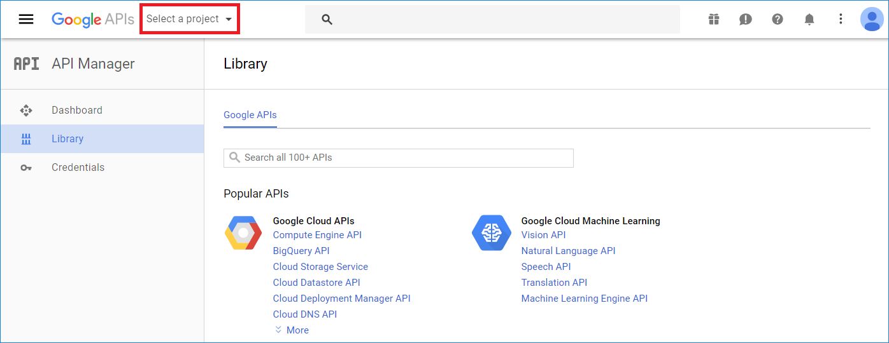

4.  Click on the **+** button.

    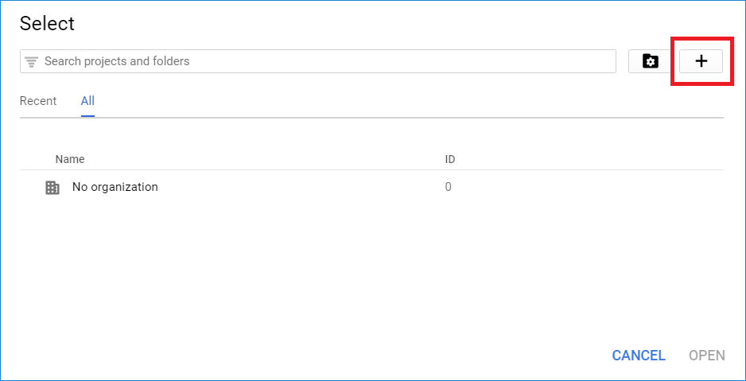

5.  Enter a **Project name**, and then click **Create**.

    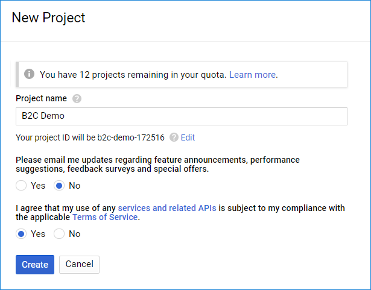

6.  Wait until the project is ready and click on the **Projects menu**.

    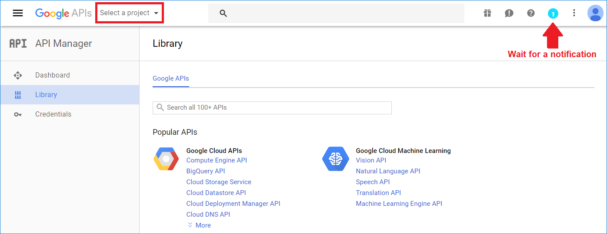

7.  Click on your project name.

    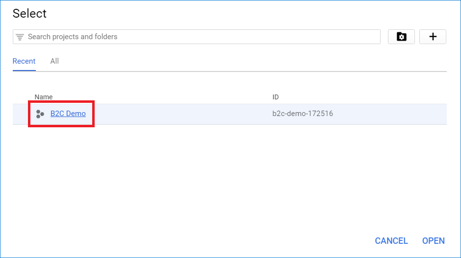

8.  Click **API Manager** and then click **Credentials** in the left navigation.
9.  Click the **OAuth consent screen** tab at the top.

    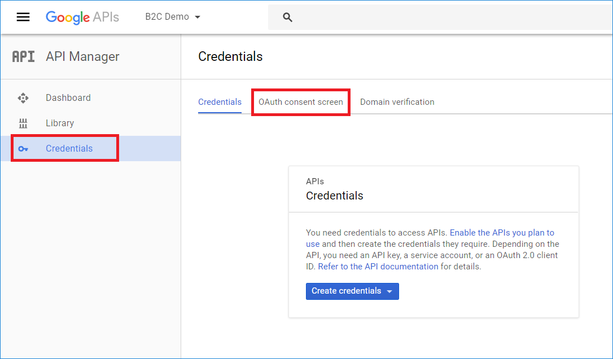

10.  Select or specify a valid **Email address**, provide a **Product name**, and click **Save**.

    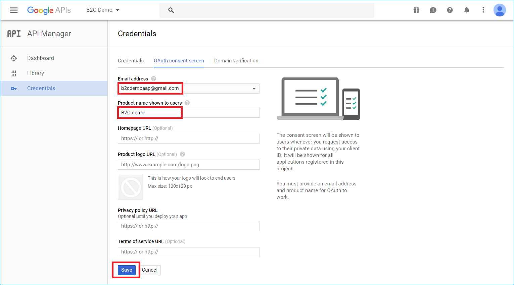

11.  Click **New credentials** and then choose **OAuth client ID**.

    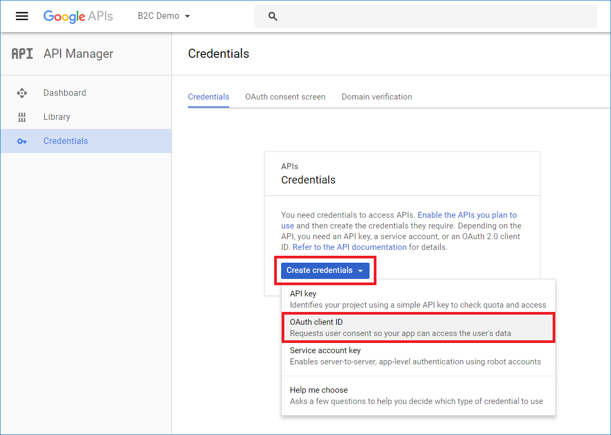

12.  Under **Application type**, select **Web application**.

    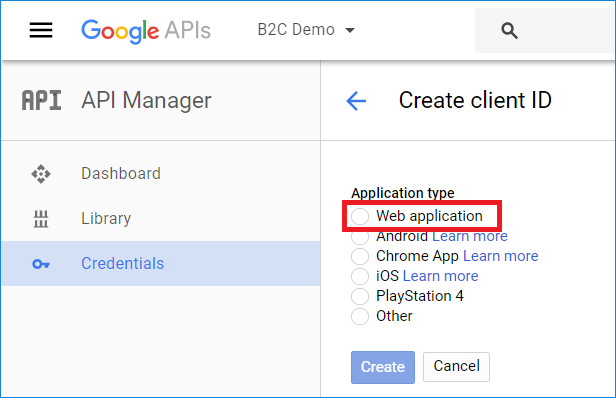

13.  Provide a **Name** for your application, enter `https://login.microsoftonline.com` in the **Authorized JavaScript origins** field, and `https://login.microsoftonline.com/te/{tenant}/oauth2/authresp` in the **Authorized redirect URIs** field. Replace **{tenant}** with your tenant's name (for example, contosob2c.onmicrosoft.com). The **{tenant}** value is case-sensitive. Click **Create**.

    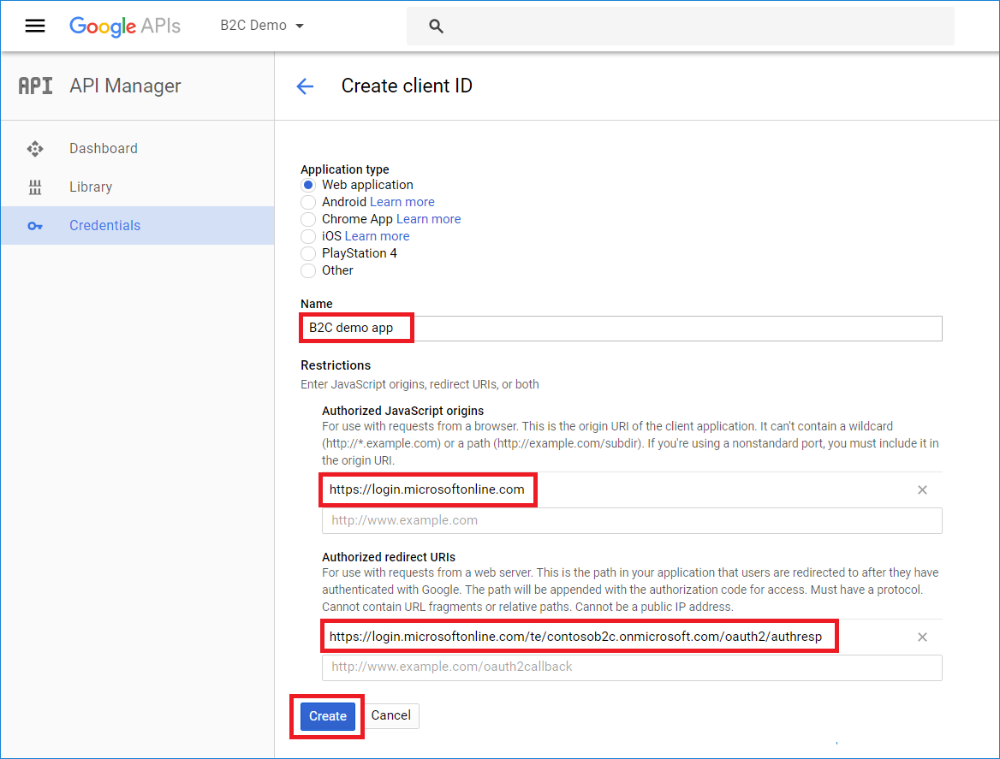

14.  Copy the values of **Client Id** and **Client secret**. You need both to configure Google+ as an identity provider in your tenant. **Client secret** is an important security credential.

    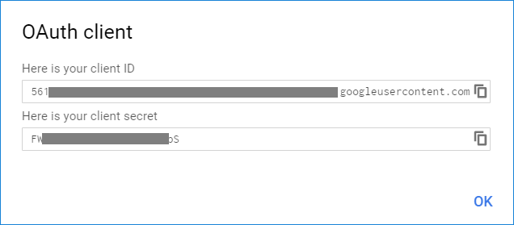

## Add the Google+ account application key to Azure AD B2C
Federation with Google+ accounts requires a client secret for Google+ account to trust Azure AD B2C on behalf of the application. You need to store your Google+ application secret in Azure AD B2C tenant:  

1.  Go to your Azure AD B2C tenant, and select **B2C Settings** > **Identity Experience Framework**
2.  Select **Policy Keys** to view the keys available in your tenant.
3.  Click **+Add**.
4.  For **Options**, use **Manual**.
5.  For **Name**, use `GoogleSecret`.  
    The prefix `B2C_1A_` might be added automatically.
6.  In the **Secret** box, enter your Google application secret from the [Google Developers Console](https://console.developers.google.com/) that you copied above.
7.  For **Key usage**, use **Signature**.
8.  Click **Create**
9.  Confirm that you've created the key `B2C_1A_GoogleSecret`.

## Add a claims provider in your extension policy

If you want users to sign in by using Google+ account, you need to define Google+ account as a claims provider. In other words, you need to specify an endpoint that Azure AD B2C communicates with. The endpoint provides a set of claims that are used by Azure AD B2C to verify that a specific user has authenticated.

Define Google+ Account as a claims provider, by adding `<ClaimsProvider>` node in your extension policy file:

1.  Open the extension policy file (TrustFrameworkExtensions.xml) from your working directory. If you need an XML editor, [try Visual Studio Code](https://code.visualstudio.com/download), a lightweight cross-platform editor.
2.  Find the `<ClaimsProviders>` section
3.  Add the following XML snippet under the `ClaimsProviders` element and replace `client_id` value with your Google+ account application client ID before saving the file.  

```xml
<ClaimsProvider>
    <Domain>google.com</Domain>
    <DisplayName>Google</DisplayName>
    <TechnicalProfiles>
    <TechnicalProfile Id="Google-OAUTH">
        <DisplayName>Google</DisplayName>
        <Protocol Name="OAuth2" />
        <Metadata>
        <Item Key="ProviderName">google</Item>
        <Item Key="authorization_endpoint">https://accounts.google.com/o/oauth2/auth</Item>
        <Item Key="AccessTokenEndpoint">https://accounts.google.com/o/oauth2/token</Item>
        <Item Key="ClaimsEndpoint">https://www.googleapis.com/oauth2/v1/userinfo</Item>
        <Item Key="scope">email</Item>
        <Item Key="HttpBinding">POST</Item>
        <Item Key="UsePolicyInRedirectUri">0</Item>
        <Item Key="client_id">Your Google+ application ID</Item>
        </Metadata>
        <CryptographicKeys>
        <Key Id="client_secret" StorageReferenceId="B2C_1A_GoogleSecret" />
        </CryptographicKeys>
        <OutputClaims>
        <OutputClaim ClaimTypeReferenceId="socialIdpUserId" PartnerClaimType="id" />
        <OutputClaim ClaimTypeReferenceId="email" PartnerClaimType="email" />
        <OutputClaim ClaimTypeReferenceId="givenName" PartnerClaimType="given_name" />
        <OutputClaim ClaimTypeReferenceId="surname" PartnerClaimType="family_name" />
        <OutputClaim ClaimTypeReferenceId="displayName" PartnerClaimType="name" />
        <OutputClaim ClaimTypeReferenceId="identityProvider" DefaultValue="google.com" />
        <OutputClaim ClaimTypeReferenceId="authenticationSource" DefaultValue="socialIdpAuthentication" />
        </OutputClaims>
        <OutputClaimsTransformations>
        <OutputClaimsTransformation ReferenceId="CreateRandomUPNUserName" />
        <OutputClaimsTransformation ReferenceId="CreateUserPrincipalName" />
        <OutputClaimsTransformation ReferenceId="CreateAlternativeSecurityId" />
        <OutputClaimsTransformation ReferenceId="CreateSubjectClaimFromAlternativeSecurityId" />
        </OutputClaimsTransformations>
        <UseTechnicalProfileForSessionManagement ReferenceId="SM-SocialLogin" />
        <ErrorHandlers>
        <ErrorHandler>
            <ErrorResponseFormat>json</ErrorResponseFormat>
            <ResponseMatch>$[?(@@.error == 'invalid_grant')]</ResponseMatch>
            <Action>Reauthenticate</Action>
            <!--In case of authorization code used error, we don't want the user to select his account again.-->
            <!--AdditionalRequestParameters Key="prompt">select_account</AdditionalRequestParameters-->
        </ErrorHandler>
        </ErrorHandlers>
    </TechnicalProfile>
    </TechnicalProfiles>
</ClaimsProvider>
```

## Register the Google+ account claims provider to Sign up or Sign in user journey

The identity provider has been set up.  However, it is not available in any of the sign-up/sign-in screens. Add the Google+ account identity provider to your user `SignUpOrSignIn` user journey. To make it available, we create a duplicate of an existing template user journey.  Then we add the Google+ account identity provider:

>[!NOTE]
>
>If you copied the `<UserJourneys>` element from base file of your policy to the extension file (TrustFrameworkExtensions.xml), you can skip to this section.

1.  Open the base file of your policy (for example, TrustFrameworkBase.xml).
2.  Find the `<UserJourneys>` element and copy the entire content of `<UserJourneys>` node.
3.  Open the extension file (for example, TrustFrameworkExtensions.xml) and find the `<UserJourneys>` element. If the element doesn't exist, add one.
4.  Paste the entire content of `<UserJourney>` node that you copied as a child of the `<UserJourneys>` element.

### Display the button
The `<ClaimsProviderSelections>` element defines the list of claims provider selection options and their order.  `<ClaimsProviderSelection>` element is analogous to an identity provider button on a sign-up/sign-in page. If you add a `<ClaimsProviderSelection>` element for Google+ account, a new button shows up when a user lands on the page. To add this element:

1.  Find the `<UserJourney>` node that includes `Id="SignUpOrSignIn"` in the user journey that you copied.
2.  Locate the `<OrchestrationStep>` node that includes `Order="1"`
3.  Add following XML snippet under `<ClaimsProviderSelections>` node:

```xml
<ClaimsProviderSelection TargetClaimsExchangeId="GoogleExchange" />
```

### Link the button to an action
Now that you have a button in place, you need to link it to an action. The action, in this case, is for Azure AD B2C to communicate with Google+ account to receive a token.

1.  Find the `<OrchestrationStep>` that includes `Order="2"` in the `<UserJourney>` node.
2.  Add following XML snippet under `<ClaimsExchanges>` node:

```xml
<ClaimsExchange Id="GoogleExchange" TechnicalProfileReferenceId="Google-OAUTH" />
```

>[!NOTE]
>
> * Ensure the `Id` has the same value as that of `TargetClaimsExchangeId` in the preceding section
> * Ensure `TechnicalProfileReferenceId` ID is set to the technical profile you created earlier (Google-OAUTH).

## Upload the policy to your tenant
1.  In the [Azure portal](https://portal.azure.com), switch into the [context of your Azure AD B2C tenant](active-directory-b2c-navigate-to-b2c-context.md), and open the **Azure AD B2C** blade.
2.  Select **Identity Experience Framework**.
3.  Open the **All Policies** blade.
4.  Select **Upload Policy**.
5.  Check **Overwrite the policy if it exists** box.
6.  **Upload** TrustFrameworkExtensions.xml and ensure that it does not fail the validation

## Test the custom policy by using Run Now
1.  Open **Azure AD B2C Settings** and go to **Identity Experience Framework**.

    >[!NOTE]
    >
    >    **Run now** requires at least one application to be preregistered on the tenant. 
    >    To learn how to register applications, see the Azure AD B2C [Get started](active-directory-b2c-get-started.md) article or the [Application registration](active-directory-b2c-app-registration.md) article.


2.  Open **B2C_1A_signup_signin**, the relying party (RP) custom policy that you uploaded. Select **Run now**.
3.  You should be able to sign in using Google+ account.

## [Optional] Register the Google+ account claims provider to Profile-Edit user journey
You may want to add the Google+ account identity provider also to your user `ProfileEdit` user journey. To make it available, we repeat the last two steps:

### Display the button
1.  Open the extension file of your policy (for example, TrustFrameworkExtensions.xml).
2.  Find the `<UserJourney>` node that includes `Id="ProfileEdit"` in the user journey that you copied.
3.  Locate the `<OrchestrationStep>` node that includes `Order="1"`
4.  Add following XML snippet under `<ClaimsProviderSelections>` node:

```xml
<ClaimsProviderSelection TargetClaimsExchangeId="GoogleExchange" />
```

### Link the button to an action
1.  Find the `<OrchestrationStep>` that includes `Order="2"` in the `<UserJourney>` node.
2.  Add following XML snippet under `<ClaimsExchanges>` node:

```xml
<ClaimsExchange Id="GoogleExchange" TechnicalProfileReferenceId="Google-OAUTH" />
```

### Upload the policy to your tenant
1.  In the [Azure portal](https://portal.azure.com), switch into the [context of your Azure AD B2C tenant](active-directory-b2c-navigate-to-b2c-context.md), and open the **Azure AD B2C** blade.
2.  Select **Identity Experience Framework**.
3.  Open the **All Policies** blade.
4.  Select **Upload Policy**.
5.  Check the **Overwrite the policy if it exists** box.
6.  **Upload** TrustFrameworkExtensions.xml and ensure that it does not fail the validation.

### Test the custom Profile-Edit policy by using Run Now

1.  Open **Azure AD B2C Settings** and go to **Identity Experience Framework**.
2.  Open **B2C_1A_ProfileEdit**, the relying party (RP) custom policy that you uploaded. Select **Run now**.
3.  You should be able to sign in using Google+ account.

## Download the complete policy files
Optional: We recommend you build your scenario using your own Custom policy files after completing the Getting Started with Custom Policies walk through instead of using these sample files.  [Sample policy files for reference](https://github.com/Azure-Samples/active-directory-b2c-custom-policy-starterpack/tree/master/scenarios/aadb2c-ief-setup-goog-app)
