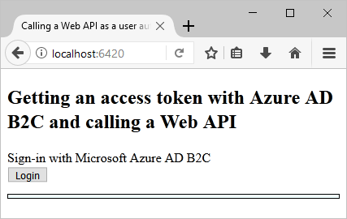
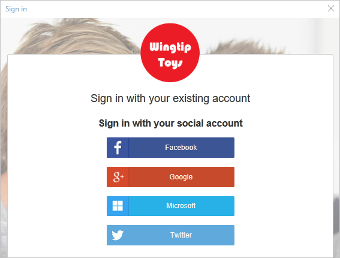
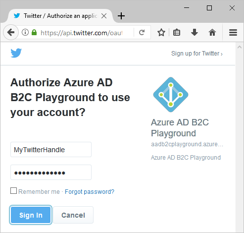
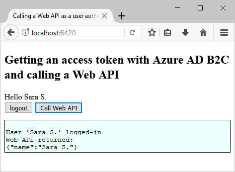

# Quickstart: Set up sign-in for a single-page app using Azure Active Directory B2C

Azure Active Directory (Azure AD) B2C provides cloud identity management to keep your application, business, and customers protected. Azure AD B2C enables your apps to authenticate to social accounts, and enterprise accounts using open standard protocols.

In this quickstart, you use an Azure AD B2C enabled sample single-page app to sign in using a social identity provider and call an Azure AD B2C protected web API.

[!INCLUDE [quickstarts-free-trial-note](../../includes/quickstarts-free-trial-note.md)]

## Prerequisites

* [Visual Studio 2017](https://www.visualstudio.com/downloads/) with the **ASP.NET and web development** workload.
* Install [Node.js](https://nodejs.org/en/download/)
* A social account from either Facebook, Google, Microsoft, or Twitter.

## Download the sample

[Download a zip file](https://github.com/Azure-Samples/active-directory-b2c-javascript-msal-singlepageapp/archive/master.zip) or clone the sample web app from GitHub.

```
git clone https://github.com/Azure-Samples/active-directory-b2c-javascript-msal-singlepageapp.git
```

## Run the sample application

To run this sample from the Node.js command prompt: 

```
cd active-directory-b2c-javascript-msal-singlepageapp
npm install && npm update
node server.js
```

The Node.js app outputs the port number it's listening on at localhost.

```
Listening on port 6420...
```

Browse to the app's URL `http://localhost:6420` in a web browser.



## Create an account

Click the **Login** button to start the Azure AD B2C **Sign Up or Sign In** workflow based on an Azure AD B2C policy. 

The sample supports several sign-up options including using a social identity provider or creating a local account using an email address. For this quickstart, use a social identity provider account from either Facebook, Google, Microsoft, or Twitter. 

### Sign up using a social identity provider

Azure AD B2C presents a custom login page for a fictitious brand called Wingtip Toys for the sample web app. 

1. To sign up using a social identity provider, click the button of the identity provider you want to use.

    

    You authenticate (sign-in) using your social account credentials and authorize the application to read information from your social account. By granting access, the application can retrieve profile information from the social account such as your name and city. 

2. Finish the sign-in process for the identity provider. For example, if you chose Twitter, enter your Twitter credentials and click **Sign in**.

    

    Your new account profile details are pre-populated with information from your social account. 

3. Update the Display Name, Job Title, and City fields and click **Continue**.  The values you enter are used for your Azure AD B2C user account profile.

    You have successfully created a new Azure AD B2C user account that uses an identity provider. 

## Access a protected web API resource

Click the **Call Web API** button to have your display name returned from the Web API call as a JSON object. 



The sample single-page app includes an Azure AD access token in the request to the protected web API resource to perform the operation to return the JSON object.

## Clean up resources

You can use your Azure AD B2C tenant if you plan to try other Azure AD B2C quickstarts or tutorials. When no longer needed, you can [delete your Azure AD B2C tenant](active-directory-b2c-faqs.md#how-do-i-delete-my-azure-ad-b2c-tenant).

## Next steps

In this quickstart, you used an Azure AD B2C enabled sample ASP.NET app to sign in with a custom login page, sign in with a social identity provider, create an Azure AD B2C account, and call a web API protected by Azure AD B2C. 

The next step is to create your own Azure AD B2C tenant and configure the sample to run using your tenant. 

> [!div class="nextstepaction"]
> [Create an Azure Active Directory B2C tenant in the Azure portal](tutorial-create-tenant.md)