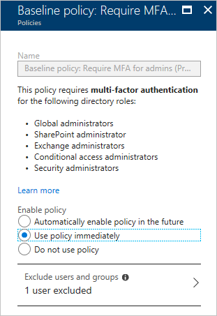

# What is baseline protection? - preview  

In the last year, identity attacks have increased by 300%. To protect your environment from the ever-increasing attacks, Azure Active Directory (Azure AD) introduces a new feature called baseline protection. Baseline protection is a set of predefined [conditional access policies](active-directory-conditional-access-azure-portal.md). The goal of these policies is to ensure that you have at least the baseline level of security enabled in all editions of Azure AD. 

This article provides you with an overview of baseline protection in Azure Active Directory.

 
## Require MFA for admins

Users with access to privileged accounts have unrestricted access to your environment. Due to the power these accounts have, you should treat them with special care. One common method to improve the protection of privileged accounts is to require a stronger form of account verification when they are used to sign-in. In Azure Active Directory, you can get a stronger account verification by requiring multi-factor authentication (MFA).  

**Require MFA for admins** is a baseline policy that requires MFA for the following directory roles: 

- Global administrator  

- SharePoint administrator  

- Exchange administrator  

- Conditional access administrator  

- Security administrator  

This baseline policy provides you with the option to exclude users and groups. You might want to exclude one *[emergency-access administrative account](active-directory-admin-manage-emergency-access-accounts.md)* to ensure you are not locked out of the tenant.

## Enable a baseline policy 

While baseline policies are in preview, they are by default not activated. You need to manually enable a policy if you want to activate it. As soon as this feature has reached general availability, the policies are by default activated. The planned behavior change is the reason why you have in addition to activate and deactivate a third option to set the state of a policy: **Automatically enable policy in the future**. By selecting this option, you let Microsoft decide when to activate a policy.      

**To enable a baseline policy:**  

1. Sign in to the [Azure portal](https://portal.azure.com) as global administrator, security administrator, or conditional access administrator.

2. In the **Azure portal**, on the left navbar, click **Azure Active Directory**.

    

3. On the **Azure Active Directory** page, in the **Manage** section, click **Conditional access**.

    

4. In the list of policies, click a policy that starts with **Baseline policy:**. 

5. To enable the policy, click **Use policy immediately**.

6. Click **Save**. 
 

  
 

## What you should know 

While managing custom conditional access policies requires an Azure AD Premium license, baseline policies are available in all editions of Azure AD.     

The directory roles that are included in the baseline policy are the most privileged Azure AD roles. 

If you have privileged accounts that are used in your scripts, you should replace them with [Managed Service Identity (MSI)](./managed-service-identity/overview.md) or [service principals with certificates](../azure-resource-manager/resource-group-authenticate-service-principal.md). As a temporary workaround, you can exclude specific user accounts from the baseline policy. 

Baseline policies apply to legacy authentication flows like POP, IMAP, older Office desktop client. 

## Next steps

If you want to know how to configure a conditional access policy, see [Get started with conditional access in Azure Active Directory](active-directory-conditional-access-azure-portal-get-started.md).

If you are ready to configure conditional access policies for your environment, see the [best practices for conditional access in Azure Active Directory](active-directory-conditional-access-best-practices.md). 
