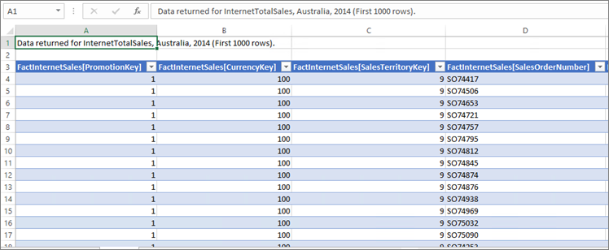
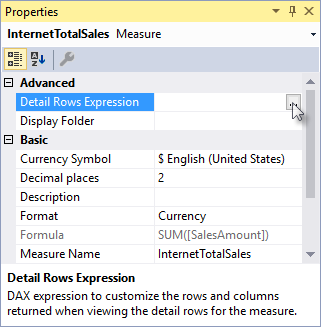
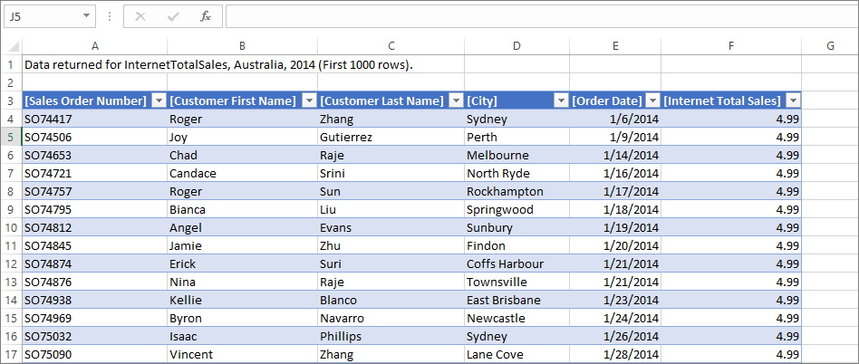

# Supplemental lesson - Detail Rows

In this supplemental lesson, you use the DAX Editor to define a custom Detail Rows Expression. A Detail Rows Expression is a property on a measure, providing end-users more information about the aggregated results of a measure. 
  
Estimated time to complete this lesson: **10 minutes**  
  
## Prerequisites  
This supplemental lesson is part of a tabular modeling tutorial. Before performing the tasks in this supplemental lesson, you should have completed all previous lessons or have a completed Adventure Works Internet Sales sample model project.  
  
## What's the issue?
Let's look at the details of the InternetTotalSales measure, before adding a Detail Rows Expression.

1.  In SSDT, click the **Model** menu > **Analyze in Excel** to open Excel and create a blank PivotTable.
  
2.  In **PivotTable Fields**, add the **InternetTotalSales** measure from the FactInternetSales table to **Values**, **CalendarYear** from the DimDate table to **Columns**, and **EnglishCountryRegionName** to **Rows**. The PivotTable now gives an aggregated results from the InternetTotalSales measure by regions and year. 

    

3. In the PivotTable, double-click an aggregated value for a year and a region name. The value for Australia and the year 2014. A new sheet opens containing data, but not useful data.

    
  
The goal here is a table containing columns and rows of data that contribute to the aggregated result of the InternetTotalSales measure. To do that, add a Detail Rows Expression as a property of the measure.

## Add a Detail Rows Expression

#### To create a Detail Rows Expression 
  
1. In the FactInternetSales table's measure grid, click the **InternetTotalSales** measure. 

2. In **Properties** > **Detail Rows Expression**, click the editor button to open the DAX Editor.

    

3. In DAX Editor, enter the following expression:

    ```
    SELECTCOLUMNS(
	FactInternetSales,
	"Sales Order Number", FactInternetSales[SalesOrderNumber],
	"Customer First Name", RELATED(DimCustomer[FirstName]),
	"Customer Last Name", RELATED(DimCustomer[LastName]),
	"City", RELATED(DimGeography[City]),
	"Order Date", FactInternetSales[OrderDate],
	"Internet Total Sales", [InternetTotalSales]
    )

    ```

    This expression specifies names, columns, and measure results from the FactInternetSales table and related tables are returned when a user double-clicks an aggregated result in a PivotTable or report.

4. Back in Excel, delete the sheet created in Step 3, then double-click an aggregated value. This time, with a Detail Rows Expression property defined for the measure, a new sheet opens containing a lot more useful data.

    

5. Redeploy your model.

  
## See also  

[SELECTCOLUMNS Function (DAX)](https://msdn.microsoft.com/library/mt761759.aspx)   
[Supplemental lesson - Dynamic security](../tutorials/aas-supplemental-lesson-dynamic-security.md)   
[Supplemental lesson - Ragged hierarchies](../tutorials/aas-supplemental-lesson-ragged-hierarchies.md)   
 