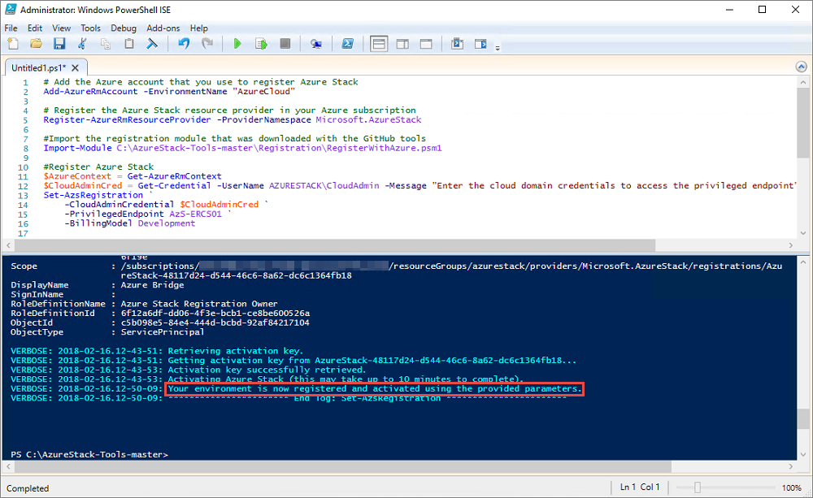
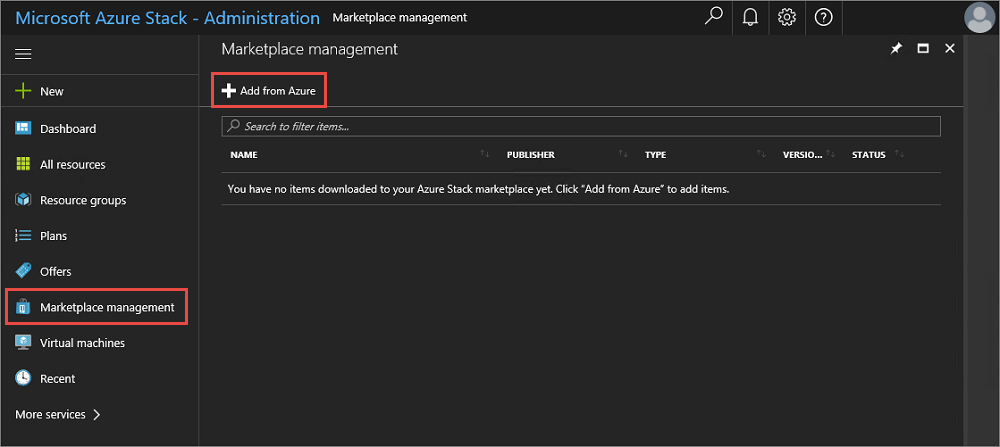
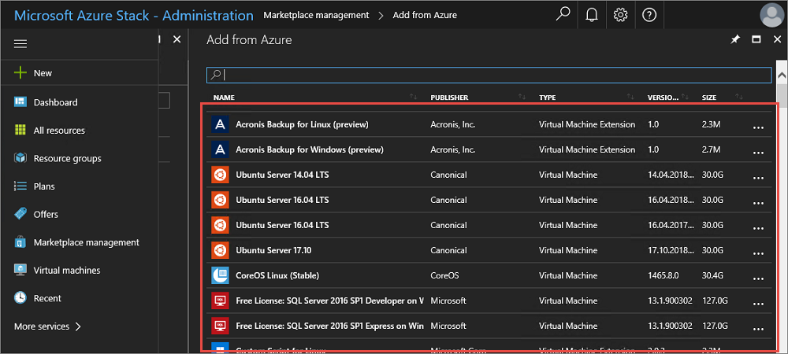

---
title: Register the ASDK with Azure | Microsoft Docs
description: Describes how to register Azure Stack with Azure to enable marketplace syndication and usage reporting.
services: azure-stack
documentationcenter: ''
author: jeffgilb
manager: femila

ms.assetid:
ms.service: azure-stack
ms.workload: na
pms.tgt_pltfrm: na
ms.devlang: na
ms.topic: article
ms.date: 06/04/2018
ms.author: jeffgilb
ms.reviewer: misainat
---

# Azure Stack registration
You can register your Azure Stack Development Kit (ASDK) installation with Azure to download marketplace items from Azure and to set up commerce data reporting back to Microsoft. Registration is required to support full Azure Stack functionality, including marketplace syndication. Registration is recommended because it enables you to test important Azure Stack functionality like marketplace syndication and usage reporting. After you register Azure Stack, usage is reported to Azure commerce. You can see it under the subscription you used for registration. However, ASDK users aren't charged for any usage they report.

If you do not register your ASDK, you might see an **Activation Required** warning alert that advises you to register your Azure Stack Development Kit. This behavior is expected.

## Prerequisites
Before using these instructions to register the ASDK with Azure, ensure that you have installed the Azure Stack PowerShell and downloaded the Azure Stack tools as described in the [post-deployment configuration](asdk-post-deploy.md) article.

In addition, the PowerShell language mode must be set to **FullLanguageMode** on the computer used to register the ASDK with Azure. To verify that the current language mode is set to full, open an elevated PowerShell window and run the following PowerShell commands:

```powershell
$ExecutionContext.SessionState.LanguageMode
```

Ensure the output returns **FullLanguageMode**. If any other language mode is returned, registration will need to be run on another computer or the language mode will need to be set to **FullLanguageMode** before continuing.

## Register Azure Stack with Azure
Follow these steps to register the ASDK with Azure.

> [!NOTE]
> All these steps must be run from a computer that has access to the privileged endpoint. For the ASDK, that's the development kit host computer.

1. Open a PowerShell console as an administrator.  

2. Run the following PowerShell commands to register your ASDK installation with Azure. You will need to log in to both your Azure subscription and the local ASDK installation. If you don’t have an Azure subscription yet, you can [create a free Azure account here](https://azure.microsoft.com/free/?b=17.06). Registering Azure Stack incurs no cost on your Azure subscription.

  ```powershell
  # Add the Azure cloud subscription environment name. Supported environment names are AzureCloud or, if using a China Azure Subscription, AzureChinaCloud.
  Add-AzureRmAccount -EnvironmentName "AzureCloud"

  # Register the Azure Stack resource provider in your Azure subscription
  Register-AzureRmResourceProvider -ProviderNamespace Microsoft.AzureStack

  #Import the registration module that was downloaded with the GitHub tools
  Import-Module C:\AzureStack-Tools-master\Registration\RegisterWithAzure.psm1

  #Register Azure Stack
  $AzureContext = Get-AzureRmContext
  $CloudAdminCred = Get-Credential -UserName AZURESTACK\CloudAdmin -Message "Enter the credentials to access the privileged endpoint."
  Set-AzsRegistration `
      -PrivilegedEndpointCredential $CloudAdminCred `
      -PrivilegedEndpoint AzS-ERCS01 `
      -BillingModel Development
  ```
3. When the script completes, you should see this message: **Your environment is now registered and activated using the provided parameters.**

    

## Verify the registration was successful
Follow these steps to verify that the ASDK registration with Azure was successful.

1. Sign in to the [Azure Stack administration portal](https://adminportal.local.azurestack.external).

2. Click **Marketplace Management** > **Add from Azure**.

    

3. If you see a list of items available from Azure, your activation was successful.

    

## Next steps
[Add an Azure Stack marketplace item](asdk-marketplace-item.md)
