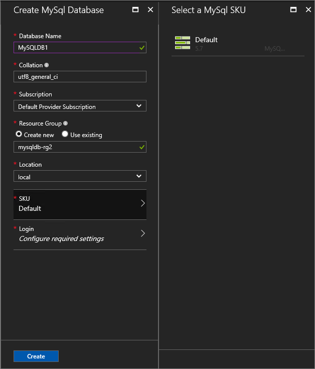
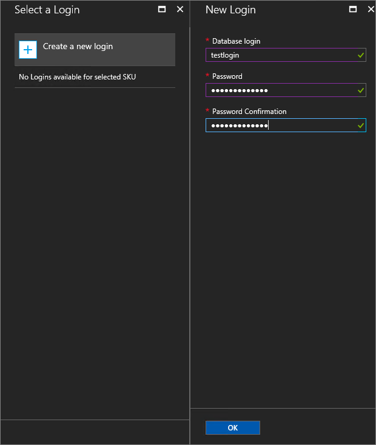

---
title: Using databases provided by the MySQL Adapter RP on Azure Stack | Microsoft Docs
description: How to create and manage MySQL databases provisioned using the MySQL Adapter Resource Provider
services: azure-stack 
documentationCenter: '' 
author: jeffgilb 
manager: femila 
editor: '' 
ms.service: azure-stack 
ms.workload: na 
ms.tgt_pltfrm: na 
ms.devlang: na 
ms.topic: article 
ms.date: 06/14/2018 
ms.author: jeffgilb 
ms.reviewer: jeffgo 
--- 

# Create MySQL databases
Self-service databases are provided through the user portal. An Azure Stack user needs a subscription that has an offer, which contains the MySQL database service.
 
## Test your deployment by creating your first MySQL database 
1. Sign in to the Azure Stack portal as a service admin. 
2. Select **+ New** > **Data + Storage** > **MySQL Database**. 
3. Provide the database details. 

    
 
4. Select a SKU. 

     

5. Create a login setting. You can reuse an existing login setting or create a new one. This setting contains the user name and password for the database. 

     

    The connections string includes the real database server name. Copy it from the portal. 

     

    > [!NOTE] 
    > The length of the user names cannot exceed 32 characters in MySQL 5.7. In earlier editions, it can't exceed 16 characters. 

## Update the administrative password 
You can modify the password by first changing it on the MySQL server instance. Select **ADMINISTRATIVE RESOURCES** > **MySQL Hosting Servers**. Then select the hosting server. In the **Settings** panel, select **Password**. 

 

## Next steps
[Update the MySQL resource provider](azure-stack-mysql-resource-provider-update.md)
