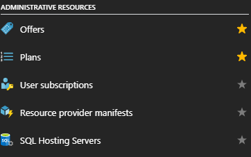
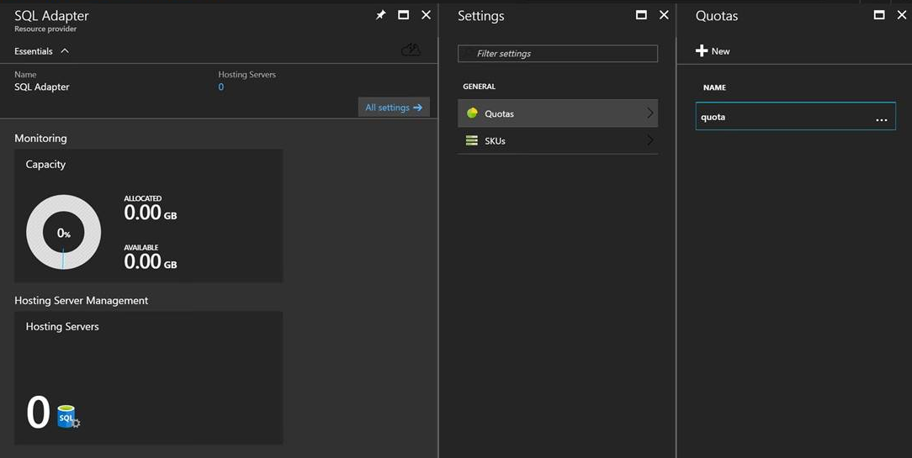

# Add hosting servers for the SQL resource provider

You can host a SQL instance on a virtual machine (VM) in [Azure Stack](azure-stack-poc.md), or on a VM outside your Azure Stack environment, as long as the SQL resource provider can connect to the instance.

## Overview

The general requirements for SQL hosting servers are:

* The SQL instance must be dedicated for use by the resource provider and user workloads. You can't use a SQL instance that's being used by any other consumer. This restriction also applies to App Services.
* The SQL resource provider VM isn't domain joined and can only connect using SQL authentication.
* You must configure an account with appropriate privileges for use by the resource provider.
* The resource provider and users, such as Web Apps, use the user network, so connectivity to the SQL instance on this network is required. This requirement typically means the IP for your SQL instances must be on a public network.
* Management of the SQL instances and their hosts is up to you. For example, the resource provider doesn't apply updates, handle backups, or handle credential rotation.
* You can use SKUs that support different classes of SQL abilities, such as performance and high availability using AlwaysOn.

### SQL Server virtual machine images

SQL IaaS virtual machine images are available through the Marketplace Management feature. These images are the same as the SQL VMs that are available in Azure.

Make sure you always download the latest version of the **SQL IaaS Extension** before you deploy a VM using a Marketplace item.  The IaaS extension and corresponding portal enhancements provide additional features such as automatic patching and backup.

There are other options for deploying SQL VMs, including templates in the [Azure Stack Quickstart Gallery](https://github.com/Azure/AzureStack-QuickStart-Templates).

> [!NOTE]
> Any hosting servers installed on a multi-node Azure Stack must be created from a user subscription. They can't be created from the Default Provider Subscription. They must be created from the user portal or from a PowerShell session with an appropriate login. All hosting servers are billable VMs and must have appropriate SQL licenses. The service administrator _can_ be the owner of that subscription.

### Required Privileges

You can create an administrative user with lower privileges that a SQL sysadmin. The user only needs permissions for the following operations:

- Database: Create, Alter, With Containment (for Always On only), Drop, Backup
- Availability Group: Alter, Join, Add/Remove Database
- Login: Create, Select, Alter, Drop, Revoke
- Select Operations: \[master\].\[sys\].\[availability_group_listeners\] (AlwaysOn), sys.availability_replicas (AlwaysOn), sys.databases, \[master\].\[sys\].\[dm_os_sys_memory\], SERVERPROPERTY, \[master\].\[sys\].\[availability_groups\] (AlwaysOn), sys.master_files

## Provide capacity by connecting to a standalone hosting SQL server

You can use standalone (non-HA) SQL servers using any edition of SQL Server 2014 or SQL Server 2016. Make sure you have the credentials for an account with sysadmin privileges.

To add a standalone hosting server that is already set up, follow these steps:

1. Sign in to the Azure Stack operator portal as a service administrator.

2. Select **Browse** &gt; **ADMINISTRATIVE RESOURCES** &gt; **SQL Hosting Servers**.

   

   Under **SQL Hosting Servers**,  you can connect the SQL resource provider to instances of SQL Server that serve as the resource provider’s backend.

   

3. Fill the form with the connection details of your SQL Server instance.

   

    You can optionally include an instance name, and specify a port number if the instance isn't assigned to the default port of 1433.

   > [!NOTE]
   > As long as the SQL instance can be accessed by the user and admin Azure Resource Manager, it can be placed under control of the resource provider. The SQL instance __must__ be allocated exclusively to the resource provider.

4. As you add servers, you must assign them to a new or existing SKU to differentiate service offerings. For example, you can have a SQL Enterprise instance that provides:
  
   - database capacity
   - automatic backup
   - reserve high-performance servers for individual departments

   All the hosting servers in a SKU should have the same capabilities. The **Name** should reflect the properties of the SKU so users can deploy their databases to the appropriate SKU.

   > [!IMPORTANT]
   > Special characters, including spaces and periods, are not supported in the **Family** or **Tier** names when you create a SKU for the SQL and MySQL resource providers.

   For example:

   

   >[!NOTE]
   > SKUs can take up to an hour to be visible in the portal. Users cannot create a database until the SKU is fully created.

## Provide high availability using SQL Always On Availability Groups

Configuring SQL Always On instances requires additional steps and requires a minimum of three VMs (or physical machines.) This article assumes that you already have a solid understanding of Always On availability groups. For more information, see:

* [Introducing SQL Server Always On availability groups on Azure virtual machines](https://docs.microsoft.com/en-us/azure/virtual-machines/windows/sql/virtual-machines-windows-portal-sql-availability-group-overview)
* [Always On Availability Groups (SQL Server)](https://docs.microsoft.com/en-us/sql/database-engine/availability-groups/windows/always-on-availability-groups-sql-server?view=sql-server-2017)

> [!NOTE]
> The SQL adapter resource provider _only_ supports SQL 2016 SP1 Enterprise or later instances for Always On. This adapter configuration requires new SQL features such as automatic seeding.

In addition to the preceding list of requirements you must enable [Automatic Seeding](https://docs.microsoft.com/sql/database-engine/availability-groups/windows/automatically-initialize-always-on-availability-group) on each availability group for each instance of SQL Server.

To enable automatic seeding on all instances, edit and then run the following SQL command for each instance:

  ```
  ALTER AVAILABILITY GROUP [<availability_group_name>]
      MODIFY REPLICA ON 'InstanceName'
      WITH (SEEDING_MODE = AUTOMATIC)
  GO
  ```

On the secondary instances, edit and then run the following SQL command for each instance:

  ```
  ALTER AVAILABILITY GROUP [<availability_group_name>] GRANT CREATE ANY DATABASE
  GO
  ```

### To add SQL Always On hosting servers

1. Sign in to the Azure Stack Administration portal as a service admin.

2. Select **Browse** &gt; **ADMINISTRATIVE RESOURCES** &gt; **SQL Hosting Servers** &gt; **+Add**.

   Under **SQL Hosting Servers** you can connect the SQL Server Resource Provider to actual instances of SQL Server that serve as the resource provider’s backend.

3. Fill out the form with the connection details for your SQL Server instance. Make sure that you use the FQDN address of the Always On Listener (and optional port number.) Provide the information for the account you configured with sysadmin privileges.

4. Check the Always On Availability Group box to enable support for SQL Always On Availability Group instances.

   

5. Add the SQL Always On instance to a SKU.

   > [!IMPORTANT]
   > You can't mix standalone servers with Always On instances in the same SKU. Attempting to mix types after adding the first hosting server results in an error.

## Make the SQL databases available to users

Create plans and offers to make SQL databases available for users. Add the **Microsoft.SqlAdapter** service to the plan, and add the default Quota, or create a new Quota.


## Next steps

[Add databases](azure-stack-sql-resource-provider-databases.md)
