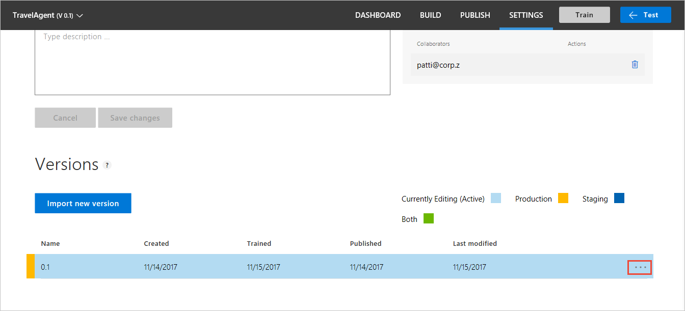
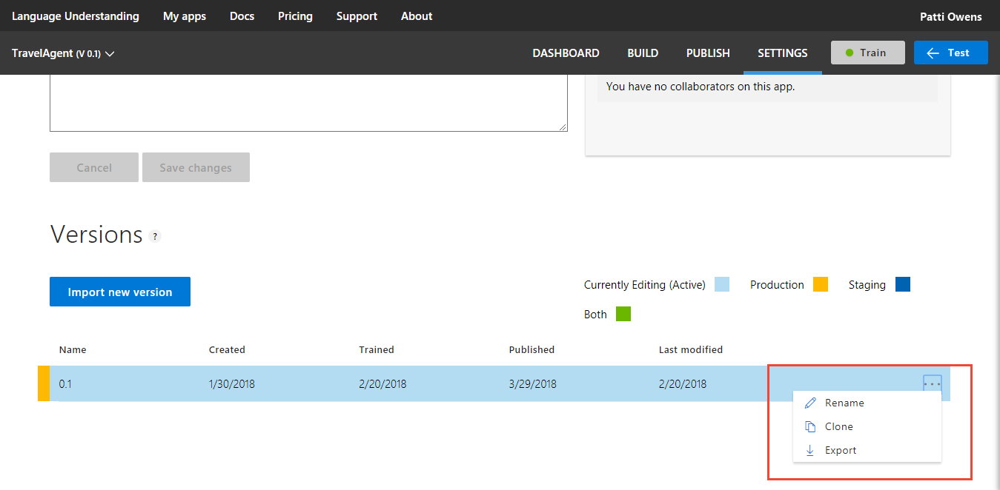
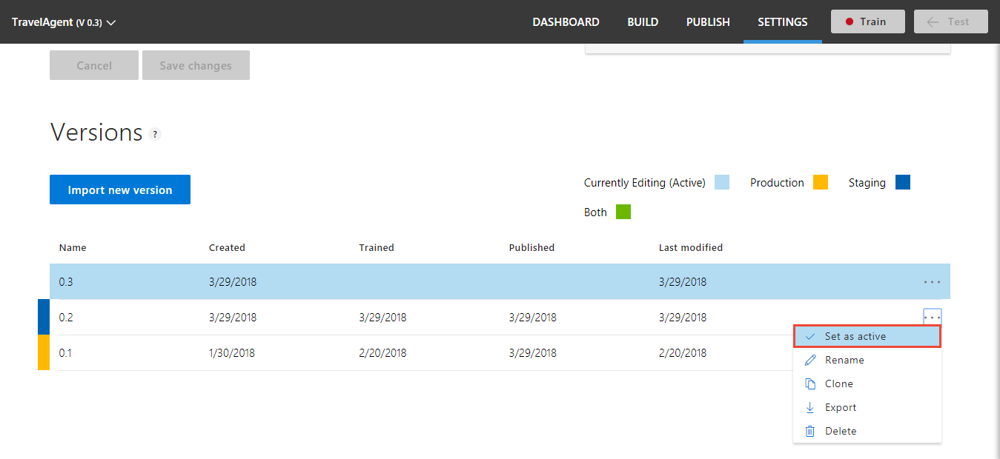
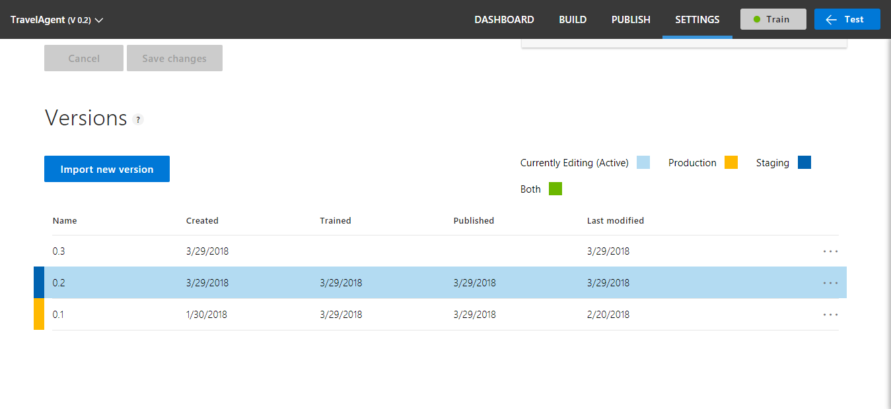
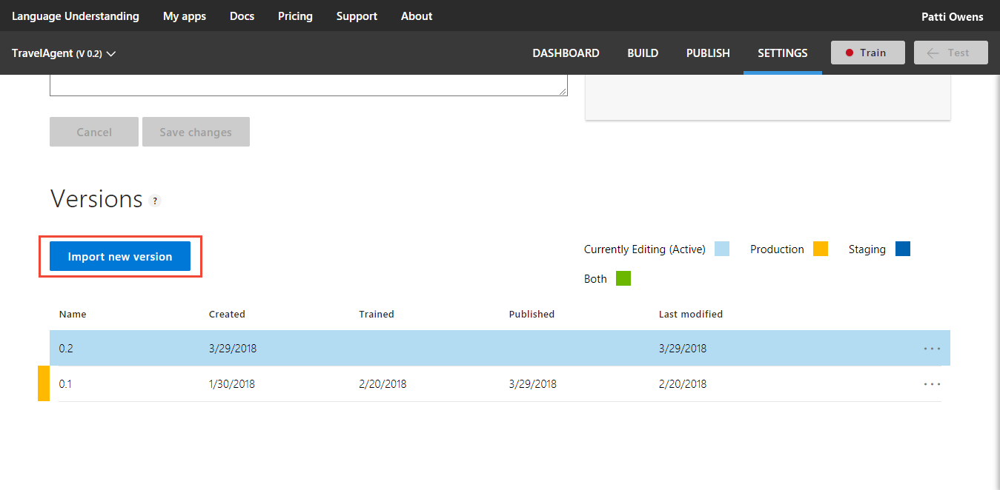
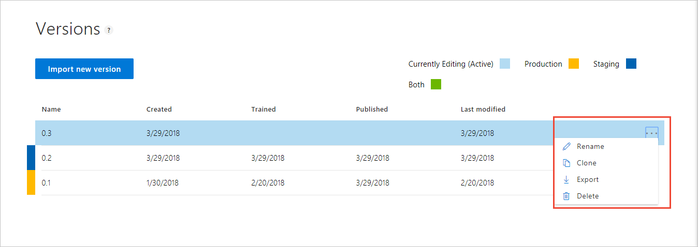
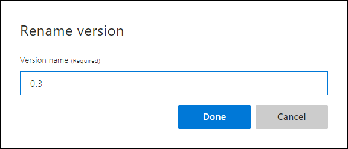

# Manage versions

Each time you work on the model, create a different [version](luis-concept-version.md) of the app. 

## Set active version
To work with versions, open your app by selecting its name on **My Apps** page, and then select **Settings** in the top bar.

The **Settings** page allows you to configure settings for the entire app including versions, and collaborators. 

## Clone a version
1. On the **Settings** page, after the App Settings and Collaborators sections, find the row with the version you want to clone. Select the three dots (...) on the far-right. 

    

2. Select **Clone** from the list.

    

3. In the **Clone version** dialog box, type a name for the new version such as "0.2".

   
 
 > [!NOTE]
 > Version ID can consist only of characters, digits or '.' and cannot be longer than 10 characters.
 
 A new version with the specified name is created and set as the active version.
 
  

 > [!NOTE]
 > As shown in the preceding image, a published version is associated with a colored mark, indicating the type of slot where it has been published: Production (green), Staging (red) and both (black). The training and publishing dates are displayed for each published version.

## Set active version
1. On the **Settings** page, in the **Versions** list, select the three dots (...) at the far right.

2. From the pop-up list, select **Set as active**.

    

    The active version is highlighted by a light blue color, as shown in the following screenshot:

     

## Import version
You can import a version from a JSON file. Once you import a version, the new version becomes the active version.

**To import a version:**

1. On the **Settings** page, select **Import new version** button.

    

2. Select **browse** and choose the JSON file.

    

You only need to set a version ID if the version in the JSON file already exists in the app.

## Export version
You can export a version to a JSON file.

**To export a version:**

1. On the **Settings** page, in the **Versions** list, select the three dots (...) at the far right.

2. Select **Export** in the pop-up list of actions and select where you want to save the file.

## Delete a version
You can delete versions, but you have to keep at least one version of the app. You can delete all versions except the active version. 

1. On the **Settings** page, in the **Versions** list, select the three dots (...) at the far right.

2. Select **Delete** in the pop-up list of actions and select where you want to save the file.

     

## Rename a version
You can rename versions as long as the version name is not already in use.  

1. On the **Settings** page, in the **Versions** list, select the three dots (...) at the far right.

2. Select **Rename** in the pop-up list of actions.

3. Enter the new version name and select **Done**.

     
