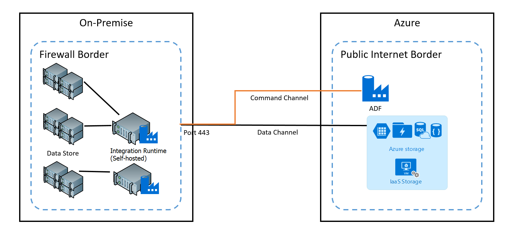
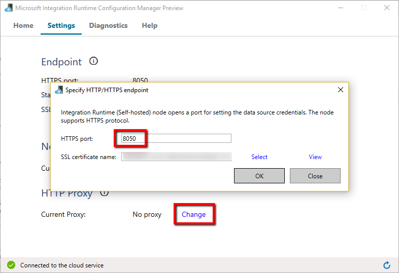
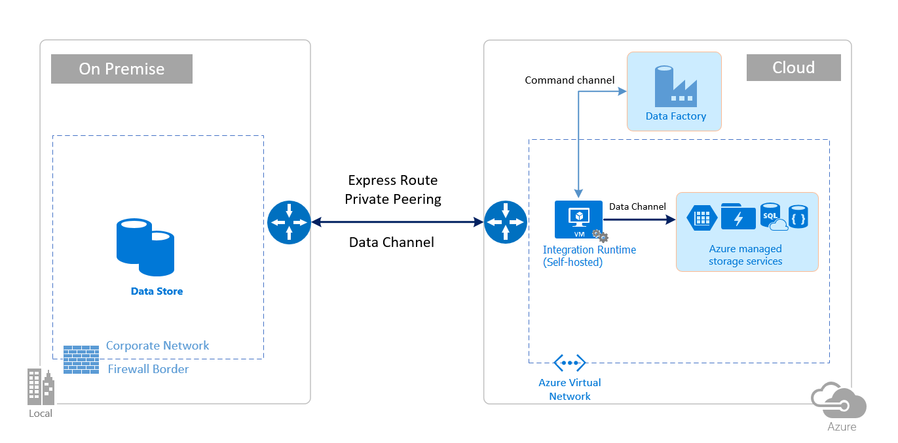

#  Security considerations for data movement in Azure Data Factory
> [!div class="op_single_selector" title1="Select the version of Data Factory service you are using:"]
> * [Version 1 - GA](v1/data-factory-data-movement-security-considerations.md)
> * [Version 2 - Preview](data-movement-security-considerations.md)

This article describes basic security infrastructure that data movement services in Azure Data Factory use to help secure your data. Data Factory management resources are built on Azure security infrastructure and use all possible security measures offered by Azure.

> [!NOTE]
> This article applies to version 2 of Data Factory, which is currently in preview. If you're using version 1 of the Data Factory service, which is generally available (GA), see [Data movement security considerations for Data Factory version 1](v1/data-factory-data-movement-security-considerations.md).

In a Data Factory solution, you create one or more data [pipelines](concepts-pipelines-activities.md). A pipeline is a logical grouping of activities that together perform a task. These pipelines reside in the region where the data factory was created. 

Even though Data Factory is only available in few regions, the data movement service is [available globally](concepts-integration-runtime.md#integration-runtime-location) to ensure data compliance, efficiency, and reduced network egress costs. 

Azure Data Factory does not store any data except for linked service credentials for cloud data stores, which are encrypted by using certificates. With Data Factory, you create data-driven workflows to orchestrate movement of data between [supported data stores](copy-activity-overview.md#supported-data-stores-and-formats), and processing of data by using [compute services](compute-linked-services.md) in other regions or in an on-premises environment. You can also monitor and manage workflows by using SDKs and Azure Monitor.

Data movement by using Data Factory has been certified for:
-	[HIPAA/HITECH](https://www.microsoft.com/en-us/trustcenter/Compliance/HIPAA) 
-	[ISO/IEC 27001](https://www.microsoft.com/en-us/trustcenter/Compliance/ISO-IEC-27001)  
-	[ISO/IEC 27018](https://www.microsoft.com/en-us/trustcenter/Compliance/ISO-IEC-27018)
-	[CSA STAR](https://www.microsoft.com/en-us/trustcenter/Compliance/CSA-STAR-Certification)

If you're interested in Azure compliance and how Azure secures its own infrastructure, visit the [Microsoft Trust Center](https://microsoft.com/en-us/trustcenter/default.aspx).

In this article, we review security considerations in the following two data movement scenarios: 

- **Cloud scenario**: In this scenario, both your source and your destination are publicly accessible through the internet. These include managed cloud storage services such as Azure Storage, Azure SQL Data Warehouse, Azure SQL Database, Azure Data Lake Store, Amazon S3, Amazon Redshift, SaaS services such as Salesforce, and web protocols such as FTP and OData. Find a complete list of supported data sources in  [Supported data stores and formats](copy-activity-overview.md#supported-data-stores-and-formats).
- **Hybrid scenario**: In this scenario, either your source or your destination is behind a firewall or inside an on-premises corporate network. Or, the data store is in a private network or virtual network (most often the source) and is not publicly accessible. Database servers hosted on virtual machines also fall under this scenario.

## Cloud scenarios

### Securing data store credentials

- **Store encrypted credentials in an Azure Data Factory managed store**. Data Factory helps protect your data store credentials by encrypting them with certificates managed by Microsoft. These certificates are rotated every two years (which includes certificate renewal and the migration of credentials). The encrypted credentials are securely stored in an Azure storage account managed by Azure Data Factory management services. For more information about Azure Storage security, see [Azure Storage security overview](../security/security-storage-overview.md).
- **Store credentials in Azure Key Vault**. You can also store the data store's credential in [Azure Key Vault](https://azure.microsoft.com/services/key-vault/). Data Factory retrieves the credential during the execution of an activity. For more information, see [Store credential in Azure Key Vault](store-credentials-in-key-vault.md).

### Data encryption in transit
If the cloud data store supports HTTPS or TLS, all data transfers between data movement services in Data Factory and a cloud data store are via secure channel HTTPS or TLS.

> [!NOTE]
> All connections to Azure SQL Database and Azure SQL Data Warehouse require encryption (SSL/TLS) while data is in transit to and from the database. When you're authoring a pipeline by using JSON, add the encryption property and set it to **true** in the connection string. For Azure Storage, you can use **HTTPS** in the connection string.

### Data encryption at rest
Some data stores support encryption of data at rest. We recommend that you enable the data encryption mechanism for those data stores. 

#### Azure SQL Data Warehouse
Transparent Data Encryption (TDE) in Azure SQL Data Warehouse helps protect against the threat of malicious activity by performing real-time encryption and decryption of your data at rest. This behavior is transparent to the client. For more information, see [Secure a database in SQL Data Warehouse](../sql-data-warehouse/sql-data-warehouse-overview-manage-security.md).

#### Azure SQL Database
Azure SQL Database also supports transparent data encryption (TDE), which helps protect against the threat of malicious activity by performing real-time encryption and decryption of the data, without requiring changes to the application. This behavior is transparent to the client. For more information, see [Transparent data encryption for SQL Database and Data Warehouse](https://docs.microsoft.com/sql/relational-databases/security/encryption/transparent-data-encryption-azure-sql).

#### Azure Data Lake Store
Azure Data Lake Store also provides encryption for data stored in the account. When enabled, Data Lake Store automatically encrypts data before persisting and decrypts before retrieval, making it transparent to the client that accesses the data. For more information, see [Security in Azure Data Lake Store](../data-lake-store/data-lake-store-security-overview.md). 

#### Azure Blob storage and Azure Table storage
Azure Blob storage and Azure Table storage support Storage Service Encryption (SSE), which automatically encrypts your data before persisting to storage and decrypts before retrieval. For more information, see [Azure Storage Service Encryption for Data at Rest](../storage/common/storage-service-encryption.md).

#### Amazon S3
Amazon S3 supports both client and server encryption of data at rest. For more information, see [Protecting Data Using Encryption](http://docs.aws.amazon.com/AmazonS3/latest/dev/UsingEncryption.html).

#### Amazon Redshift
Amazon Redshift supports cluster encryption for data at rest. For more information, see [Amazon Redshift Database Encryption](http://docs.aws.amazon.com/redshift/latest/mgmt/working-with-db-encryption.html). 

#### Salesforce
Salesforce supports Shield Platform Encryption that allows encryption of all files, attachments, and custom fields. For more information, see [Understanding the Web Server OAuth Authentication Flow](https://developer.salesforce.com/docs/atlas.en-us.api_rest.meta/api_rest/intro_understanding_web_server_oauth_flow.htm).  

## Hybrid scenarios
Hybrid scenarios require self-hosted integration runtime to be installed in an on-premises network, inside a virtual network (Azure), or inside a virtual private cloud (Amazon). The self-hosted integration runtime must be able to access the local data stores. For more information about self-hosted integration runtime, see [How to create and configure self-hosted integration runtime](https://docs.microsoft.com/azure/data-factory/create-self-hosted-integration-runtime). 

The command channel allows communication between data movement services in Data Factory and self-hosted integration runtime. The communication contains information related to the activity. The data channel is used for transferring data between on-premises data stores and cloud data stores.    

### On-premises data store credentials
The credentials for your on-premises data stores are always encrypted and stored. They can be either stored locally on the self-hosted integration runtime machine, or stored in Azure Data Factory managed storage (just like cloud store credentials). 

- **Store credentials locally**. If you want to encrypt and store credentials locally on the self-hosted integration runtime, follow the steps in [Encrypt credentials for on-premises data stores in Azure Data Factory](encrypt-credentials-self-hosted-integration-runtime.md). All connectors support this option. The self-hosted integration runtime uses Windows [DPAPI](https://msdn.microsoft.com/library/ms995355.aspx) to encrypt the sensitive data and credential information. 

   Use the **New-AzureRmDataFactoryV2LinkedServiceEncryptedCredential** cmdlet to encrypt linked service credentials and sensitive details in the linked service. You can then use the JSON returned (with the **EncryptedCredential** element in the connection string) to create a linked service by using the **Set-AzureRmDataFactoryV2LinkedService** cmdlet.  

- **Store in Azure Data Factory managed storage**. If you directly use the **Set-AzureRmDataFactoryV2LinkedService** cmdlet with the connection strings and credentials inline in the JSON, the linked service is encrypted and stored in Azure Data Factory managed storage. The sensitive information is still encrypted by certificate, and Microsoft manages these certificates.

#### Ports used when encrypting linked service on self-hosted integration runtime
By default, PowerShell uses port 8050 on the machine with self-hosted integration runtime for secure communication. If necessary, this port can be changed.  

 

### Encryption in transit
All data transfers are via secure channel HTTPS and TLS over TCP to prevent man-in-the-middle attacks during communication with Azure services.

You can also use [IPSec VPN](../vpn-gateway/vpn-gateway-about-vpn-devices.md) or [Azure ExpressRoute](../expressroute/expressroute-introduction.md) to further secure the communication channel between your on-premises network and Azure.

Azure Virtual Network is a logical representation of your network in the cloud. You can connect an on-premises network to your virtual network by setting up IPSec VPN (site-to-site) or ExpressRoute (private peering).	

The following table summarizes the network and self-hosted integration runtime configuration recommendations based on different combinations of source and destination locations for hybrid data movement.

| Source      | Destination                              | Network configuration                    | Integration runtime setup                |
| ----------- | ---------------------------------------- | ---------------------------------------- | ---------------------------------------- |
| On-premises | Virtual machines and cloud services deployed in virtual networks | IPSec VPN (point-to-site or site-to-site) | The self-hosted integration runtime can be installed either on-premises or on an Azure virtual machine in a virtual network. |
| On-premises | Virtual machines and cloud services deployed in virtual networks | ExpressRoute (private peering)           | The self-hosted integration runtime can be installed either on-premises or on an Azure virtual machine in a virtual network. |
| On-premises | Azure-based services that have a public endpoint | ExpressRoute (public peering)            | The self-hosted integration runtime must be installed on-premises. |

The following images show the use of self-hosted integration runtime for moving data between an on-premises database and Azure services by using ExpressRoute and IPSec VPN (with Azure Virtual Network):

**ExpressRoute**

 

**IPSec VPN**

###  Firewall configurations and whitelisting IP addresses

#### Firewall requirements for on-premises/private network	
In an enterprise, a corporate firewall runs on the central router of the organization. Windows Firewall runs as a daemon on the local machine in which the self-hosted integration runtime is installed. 

The following table provides outbound port and domain requirements for corporate firewalls:

| Domain names                  | Outbound ports | Description                              |
| ----------------------------- | -------------- | ---------------------------------------- |
| `*.servicebus.windows.net`    | 443            | Required by the self-hosted integration runtime to connect to data movement services in Data Factory. |
| `*.core.windows.net`          | 443            | Used by the self-hosted integration runtime to connect to the Azure storage account when you use the [staged copy](copy-activity-performance.md#staged-copy) feature. |
| `*.frontend.clouddatahub.net` | 443            | Required by the self-hosted integration runtime to connect to the Data Factory service. |
| `*.database.windows.net`      | 1433           | (Optional) Required when you copy from or to Azure SQL Database or Azure SQL Data Warehouse. Use the staged copy feature to copy data to Azure SQL Database or Azure SQL Data Warehouse without opening port 1433. |
| `*.azuredatalakestore.net` `login.microsoftonline.com/<tenant>/oauth2/token`    | 443            | (Optional) Required when you copy from or to  Azure Data Lake Store. |

> [!NOTE] 
> You might have to manage ports or whitelisting domains at the corporate firewall level as required by the respective data sources. This table only uses Azure SQL Database, Azure SQL Data Warehouse, and Azure Data Lake Store as examples.   

The following table provides inbound port requirements for Windows Firewall:

| Inbound ports | Description                              |
| ------------- | ---------------------------------------- |
| 8050 (TCP)    | Required by the PowerShell encryption cmdlet as described in [Encrypt credentials for on-premises data stores in Azure Data Factory](encrypt-credentials-self-hosted-integration-runtime.md), and by the credential manager application to securely set credentials for on-premises data stores on the self-hosted integration runtime. |

 

#### IP configurations and whitelisting in data stores
Some data stores in the cloud also require that you whitelist the IP address of the machine accessing the store. Ensure that the IP address of the self-hosted integration runtime machine is whitelisted or configured in the firewall appropriately.

The following cloud data stores require that you whitelist the IP address of the self-hosted integration runtime machine. Some of these data stores, by default, might not require whitelisting. 

- [Azure SQL Database](../sql-database/sql-database-firewall-configure.md) 
- [Azure SQL Data Warehouse](../sql-data-warehouse/sql-data-warehouse-get-started-provision.md)
- [Azure Data Lake Store](../data-lake-store/data-lake-store-secure-data.md#set-ip-address-range-for-data-access)
- [Azure Cosmos DB](../cosmos-db/firewall-support.md)
- [Amazon Redshift](http://docs.aws.amazon.com/redshift/latest/gsg/rs-gsg-authorize-cluster-access.html) 

## Frequently asked questions

**Can the self-hosted integration runtime be shared across different data factories?**

We do not support this feature yet. We are actively working on it.

**What are the port requirements for the self-hosted integration runtime to work?**

The self-hosted integration runtime makes HTTP-based connections to access the internet. The outbound ports 443 and 80 must be opened for the self-hosted integration runtime to make this connection. Open inbound port 8050 only at the machine level (not the corporate firewall level) for credential manager application. If Azure SQL Database or Azure SQL Data Warehouse is used as the source or the destination, you need to open port 1433 as well. For more information, see the [Firewall configurations and whitelisting IP addresses](#firewall-configurations-and-whitelisting-ip-address-of-gateway) section. 

## Next steps
For information about Azure Data Factory Copy Activity performance, see [Copy Activity performance and tuning guide](copy-activity-performance.md).

 
