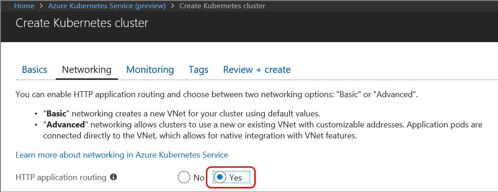
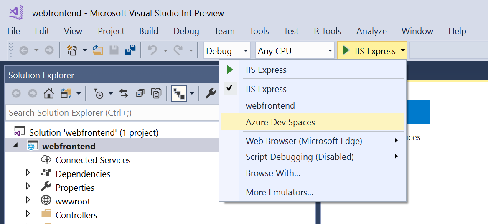
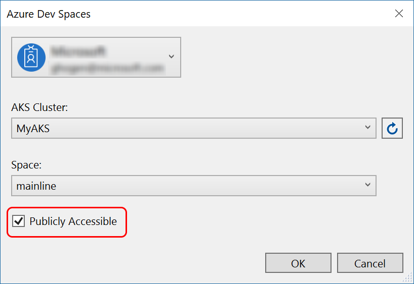
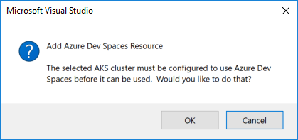

# Quickstart: Create a Kubernetes dev space with Azure Dev Spaces (.NET Core and Visual Studio)

In this guide, you will learn how to:

- Set up Azure Dev Spaces with a managed Kubernetes cluster in Azure.
- Iteratively develop code in containers using Visual Studio.
- Debug code running in your cluster.

> [!Note]
> **If you get stuck** at any time, see the [Troubleshooting](troubleshooting.md) section, or post a comment on this page. You can also try the more detailed [tutorial](get-started-netcore-visualstudio.md).

## Prerequisites

- A Kubernetes cluster running Kubernetes 1.9.6, in the EastUS, WestEurope, or CanadaEast region, with Http Application Routing enabled.

  

- Visual Studio 2017 with the Web Development workload installed. If you don't have it installed, download it [here](https://aka.ms/vsdownload?utm_source=mscom&utm_campaign=msdocs).

## Set up Azure Dev Spaces

Install the [Visual Studio extension for Azure Dev Spaces](https://aka.ms/get-azds-visualstudio).

## Connect to a cluster

Next, you'll create and configure a project for Azure Dev Spaces.

### Create an ASP.NET web app

From within Visual Studio 2017, create a new project. Currently, the project must be an **ASP.NET Core Web Application**. Name the project **webfrontend**.

Select the **Web Application (Model-View-Controller)** template and be sure you're targeting **.NET Core** and **ASP.NET Core 2.0**.

### Enable Dev Spaces for an AKS cluster

With the project you just created, select **Azure Dev Spaces** from the launch settings dropdown, as shown below.

In the dialog that is displayed next, make sure you are signed in with the appropriate account, and then select an existing cluster.

Leave the **Space** dropdown set to `default` for now. Check the **Publicly Accessible** checkbox so the web app will be accessible via a public endpoint.

Click **OK** to select or create the cluster.

If you choose a cluster that hasn't been configured to work with Azure Dev Spaces, you'll see a message asking if you want to configure it.

Choose **OK**. 

### Look at the files added to project
While you wait for the dev space to be created, look at the files that have been added to your project when you chose to use Azure Dev Spaces.

- A folder named `charts` has been added and within this folder a [Helm chart](https://docs.helm.sh) for your application has been scaffolded. These files are used to deploy your application into the dev space.
- `Dockerfile` has information needed to package your application in the standard Docker format.
- `azds.yaml` contains development-time configuration that is needed by the dev space.

## Debug a container in Kubernetes
Once the dev space is successfully created, you can debug the application. Set a breakpoint in the code, for example on line 20 in the file `HomeController.cs` where the `Message` variable is set. Click **F5** to start debugging. 

Visual Studio will communicate with the dev space to build and deploy the application and then open a browser with the web app running. It might seem like the container is running locally, but actually it's running in the dev space in Azure. The reason for the localhost address is because Azure Dev Spaces creates a temporary SSH tunnel to the container running in Azure.

Click on the **About** link at the top of the page to trigger the breakpoint. You have full access to debug information just like you would if the code was executing locally, such as the call stack, local variables, exception information, and so on.

## Next steps

> [!div class="nextstepaction"]
> [Working with multiple containers and team development](get-started-netcore-visualstudio.md#call-another-container)