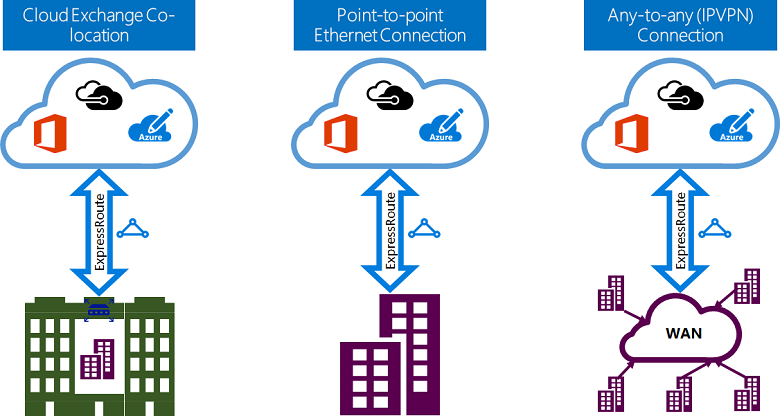

# ExpressRoute connectivity models
You can create a connection between your on-premises network and the Microsoft cloud in three different ways, [CloudExchange Co-location](#CloudExchange), [Point-to-point Ethernet Connection](#Ethernet), and [Any-to-any (IPVPN) Connection](#IPVPN). Connectivity providers can offer one or more connectivity models. You can work with your connectivity provider to pick the model that works best for you.
  

## Co-located at a cloud exchange
If you are co-located in a facility with a cloud exchange, you can order virtual cross-connections to the Microsoft cloud through the co-location provider’s Ethernet exchange. Co-location providers can offer either Layer 2 cross-connections, or managed Layer 3 cross-connections between your infrastructure in the co-location facility and the Microsoft cloud.

## Point-to-point Ethernet connections
You can connect your on-premises datacenters/offices to the Microsoft cloud through point-to-point Ethernet links. Point-to-point Ethernet providers can offer Layer 2 connections, or managed Layer 3 connections between your site and the Microsoft cloud.

## Any-to-any (IPVPN) networks
You can integrate your WAN with the Microsoft cloud. IPVPN providers (typically MPLS VPN) offer any-to-any connectivity between your branch offices and datacenters. The Microsoft cloud can be interconnected to your WAN to make it look just like any other branch office. WAN providers typically offer managed Layer 3 connectivity. ExpressRoute capabilities and features are all identical across all of the above connectivity models. 

## Next steps
* Learn about ExpressRoute connections and routing domains. See [ExpressRoute circuits and routing domains](expressroute-circuit-peerings.md).
* Learn about ExpressRoute features. See the [ExpressRoute Technical Overview](expressroute-introduction.md)
* Find a service provider. See [ExpressRoute partners and peering locations](expressroute-locations.md).
* Ensure that all prerequisites are met. See [ExpressRoute prerequisites](expressroute-prerequisites.md).
* Refer to the requirements for [Routing](expressroute-routing.md), [NAT](expressroute-nat.md), and [QoS](expressroute-qos.md).
* Configure your ExpressRoute connection.
  * [Create an ExpressRoute circuit](expressroute-howto-circuit-portal-resource-manager.md)
  * [Configure routing](expressroute-howto-routing-portal-resource-manager.md)
  * [Link a VNet to an ExpressRoute circuit](expressroute-howto-linkvnet-portal-resource-manager.md)