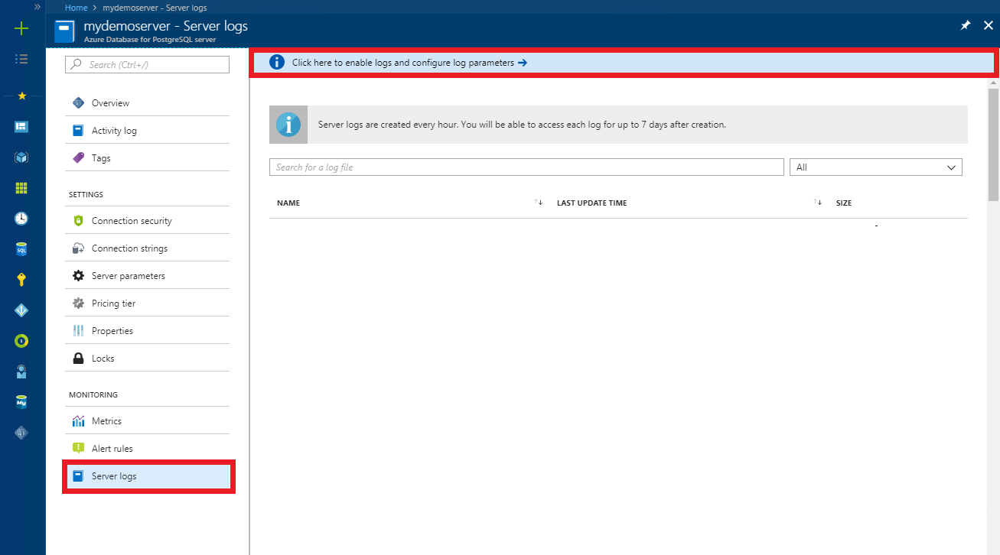
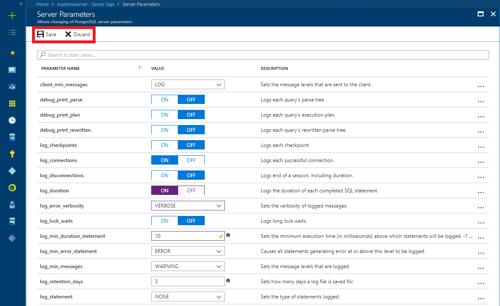

# Configure and access server logs in the Azure portal

You can configure, list, and download the [Azure Database for PostgreSQL server logs](concepts-server-logs.md) from the Azure portal.

## Prerequisites
To step through this how-to guide, you need:
- [Azure Database for PostgreSQL server](quickstart-create-server-database-portal.md)

## Configure logging
Configure access to the query logs and error logs. 

1. Sign in to the [Azure portal](http://portal.azure.com/).

2. Select your Azure Database for PostgreSQL server.

3. Under the **Monitoring** section in the sidebar, select **Server Logs**. 

   

4. Select the heading **Click here to enable logs and configure log parameters** to see the server parameters.

5. Change the parameters that you need to adjust. All changes you make in this session are highlighted in purple.

   Once you have changed the parameters, you can click **Save**. Or you can **Discard** your changes. 

   

6. Return to the list of logs by clicking the **close button** (X icon) on the **Server Parameters** page.

## View list and download logs
Once logging begins, you can view a list of available logs and download individual log files on the Server Logs pane. 

1. Open the Azure portal.

2. Select your Azure Database for PostgreSQL server.

3. Under the **Monitoring** section in the sidebar, select **Server Logs**. The page shows a list of your log files, as shown:

   

   > [!TIP]
   > The naming convention of the log is **postgresql-yyyy-mm-dd_hh0000.log**. The date and time used in the file name is the time is when the log was issued. The log files rotate every one hour or 100-MB size, whichever comes first.

4. If needed, use the **search box** to quickly narrow down to a specific log based on date/time. The search is on the name of the log.

   

5. Download individual log files using the **download** button (down arrow icon) next to each log file in the table row as shown:

   

## Next steps
- See [Access Server Logs in CLI](howto-configure-server-logs-using-cli.md) to learn how to download logs programmatically.
- Learn more about [Server Logs](concepts-server-logs.md) in Azure DB for PostgreSQL. 
- For more information about the parameter definitions and PostgreSQL logging, see the PostgreSQL documentation on [Error Reporting and Logging](https://www.postgresql.org/docs/current/static/runtime-config-logging.html).

