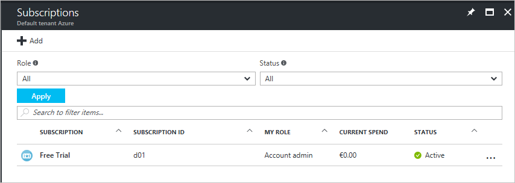
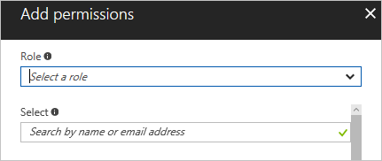
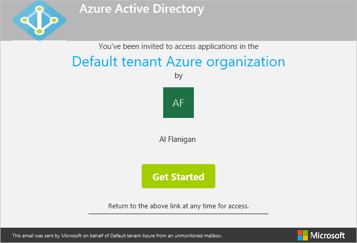
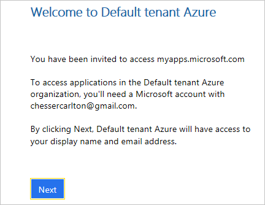
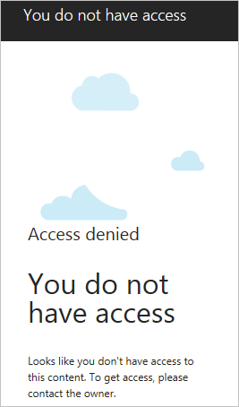
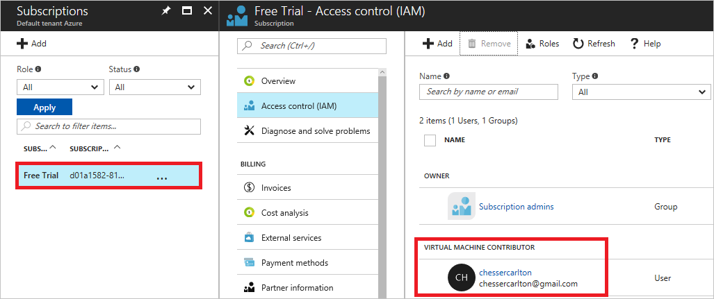
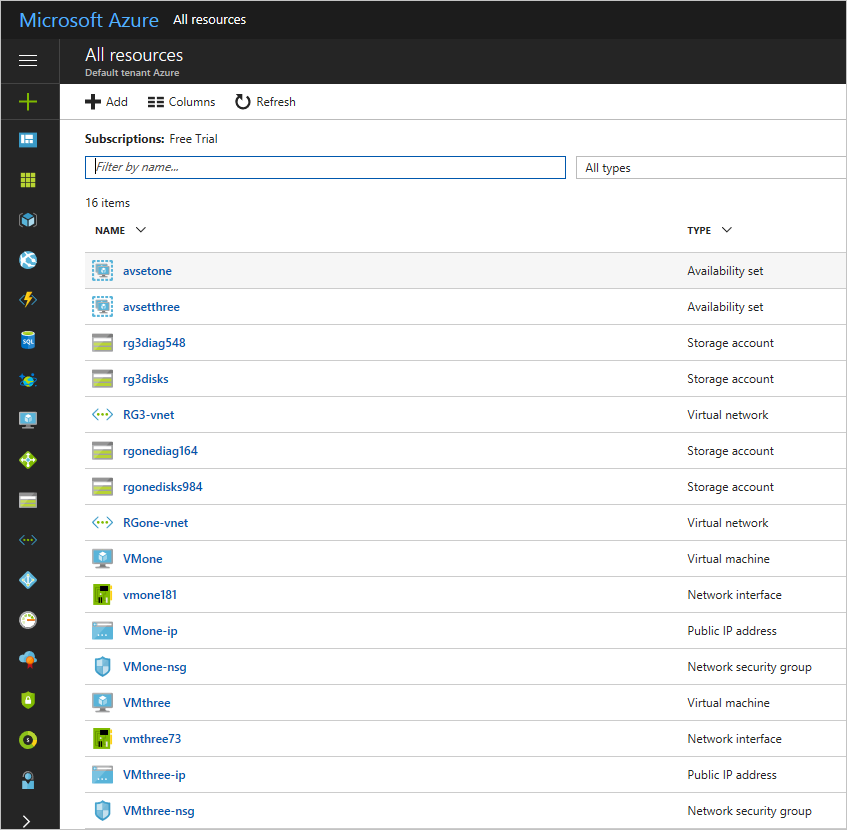
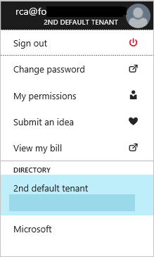
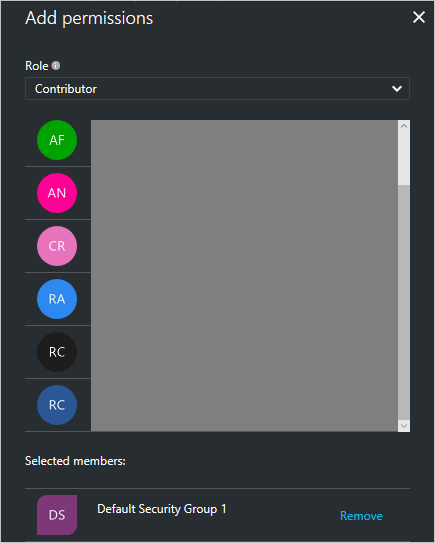

# Manage access for external users using RBAC

Role-based access control (RBAC) allows better security management for large organizations and for SMBs working with external collaborators, vendors, or freelancers that need access to specific resources in your environment but not necessarily to the entire infrastructure or any billing-related scopes. RBAC allows the flexibility of owning one Azure subscription managed by the administrator account (service administrator role at a subscription level) and have multiple users invited to work under the same subscription but without any administrative rights for it.

> [!NOTE]
> Office 365 subscriptions or Azure Active Directory licenses (for example: Access to Azure Active Directory) provisioned from the Office 365 Admin center don't qualify for using RBAC.

## Assign RBAC roles at the subscription scope

There are two common examples when RBAC is used (but not limited to):

* Having external users from the organizations (not part of the admin user's Azure Active Directory tenant) invited to manage certain resources or the whole subscription
* Working with users inside the organization (they are part of the user's Azure Active Directory tenant) but part of different teams or groups that need granular access either to the whole subscription or to certain resource groups or resource scopes in the environment

## Grant access at a subscription level for a user outside of Azure Active Directory

RBAC roles can be granted only by **Owners** of the subscription. Therefore, the administrator must be logged in as a user that has this role pre-assigned or has created the Azure subscription.

From the Azure portal, after you sign in as admin, select “Subscriptions” and chose the desired one.

By default, if the admin user has purchased the Azure subscription, the user will show up as **Account Admin**, this being the subscription role. For more information about the Azure subscription roles, see [Add or change Azure administrator roles that manage the subscription or services](../billing/billing-add-change-azure-subscription-administrator.md).

In this example, the user "alflanigan@outlook.com" is the **Owner** of the "Free Trial" subscription in the AAD tenant "Default tenant Azure". Since this user is the creator of the Azure subscription with the initial Microsoft Account “Outlook” (Microsoft Account = Outlook, Live etc.) the default domain name for all other users added in this tenant will be **"\@alflaniganuoutlook.onmicrosoft.com"**. By design, the syntax of the new domain is formed by putting together the username and domain name of the user who created the tenant and adding the extension **".onmicrosoft.com"**.
Furthermore, users can sign in with a custom domain name in the tenant after adding and verifying it for the new tenant. For more information on how to verify a custom domain name in an Azure Active Directory tenant, see [Add a custom domain name to your directory](/active-directory/active-directory-add-domain).

In this example, the "Default tenant Azure" directory contains only users with the domain name "\@alflanigan.onmicrosoft.com".

After selecting the subscription, the admin user must click **Access Control (IAM)** and then **Add a new role**.

The next step is to select the role to be assigned and the user whom the RBAC role will be assigned to. In the **Role** dropdown menu, the admin user sees only the built-in RBAC roles that are available in Azure. For more detailed explanations of each role and their assignable scopes, see [Built-in roles](built-in-roles.md).

The admin user then needs to add the email address of the external user. The expected behavior is for the external user to not show up in the existing tenant. After the external user has been invited, he will be visible under **Subscriptions > Access Control (IAM)** with all the current users that are currently assigned an RBAC role at the Subscription scope.

The user "chessercarlton@gmail.com" has been invited to be an **Owner** for the “Free Trial” subscription. After sending the invitation, the external user will receive an email confirmation with an activation link.

Being external to the organization, the new user does not have any existing attributes in the "Default tenant Azure" directory. They will be created after the external user has given consent to be recorded in the directory that is associated with the subscription he has been assigned a role to.

The external user shows in the Azure Active Directory tenant from now on as external user and this can be viewed in the Azure portal.

In the **Users** view, the external users can be recognized by the different icon type in the Azure portal.

However, granting **Owner** or **Contributor** access to an external user at the **Subscription** scope, does not allow the access to the admin user's directory, unless the **Global Admin** allows it. In the user proprieties,  the **User Type**, which has two common parameters, **Member** and **Guest** can be identified. A member is a user that is registered in the directory while a guest is a user invited to the directory from an external source. For more information, see [How do Azure Active Directory admins add B2B collaboration users](../active-directory/active-directory-b2b-admin-add-users.md).

> [!NOTE]
> Make sure that after entering the credentials in the portal, the external user selects the correct directory to sign in to. The same user can have access to multiple directories and can select either one of  them by clicking the username in the top right-hand side in the Azure portal and then choose the appropriate directory from the dropdown list.

While being a guest in the directory, the external user can manage all resources for the Azure subscription, but can't access the directory.

Azure Active Directory and an Azure subscription don't have a child-parent relation like other Azure resources (for example: virtual machines, virtual networks, web apps, storage etc.) have with an Azure subscription. All the latter is created, managed, and billed under an Azure subscription while an Azure subscription is used to manage the access to an Azure directory. For more information, see [How an Azure subscription is related to Azure AD](/active-directory/active-directory-how-subscriptions-associated-directory).

From all the built-in RBAC roles, **Owner** and **Contributor** offer full management access to all resources in the environment, the difference being that a Contributor can't create and delete new RBAC roles. The other built-in roles like **Virtual Machine Contributor** offer full management access only to the resources indicated by the name, regardless of the **Resource Group** they are being created into.

Assigning the built-in RBAC role of **Virtual Machine Contributor** at a subscription level, means that the user assigned the role:

* Can view all virtual machines regardless their deployment date and the resource groups they are part of
* Has full management access to the virtual machines in the subscription
* Can't view any other resource types in the subscription
* Can't operate any changes from a billing perspective

## Assign a built-in RBAC role to an external user

For a different scenario in this test, the external user "alflanigan@gmail.com" is added as a **Virtual Machine Contributor**.

The normal behavior for this external user with this built-in role is to see and manage only virtual machines and their adjacent Resource Manager only resources necessary while deploying. By design, these limited roles offer access only to their correspondent resources created in the Azure portal.

## Grant access at a subscription level for a user in the same directory

The process flow is identical to adding an external user, both from the admin perspective granting the RBAC role as well as the user being granted access to the role. The difference here is that the invited user will not receive any email invitations as all the resource scopes within the subscription will be available in the dashboard after signing in.

## Assign RBAC roles at the resource group scope

Assigning an RBAC role at a **Resource Group** scope has an identical process for assigning the role at the subscription level, for both types of users - either external or internal (part of the same directory). The users that are assigned the RBAC role is to see in their environment only the resource group they have been assigned access from the **Resource Groups** icon in the Azure portal.

## Assign RBAC roles at the resource scope

Assigning an RBAC role at a resource scope in Azure has an identical process for assigning the role at the subscription level or at the resource group level, following the same workflow for both scenarios. Again, the users that are assigned the RBAC role can see only the items that they have been assigned access to, either in the **All Resources** tab or directly in their dashboard.

An important aspect for RBAC both at resource group scope or resource scope is for the users to make sure to sign in to the correct directory.

## Assign RBAC roles for an Azure Active Directory group

All the scenarios using RBAC at the three different scopes in Azure offer the privilege of managing, deploying, and administering various resources as an assigned user without the need of managing a personal subscription. Regardless the RBAC role is assigned for a subscription, resource group, or resource scope, all the resources created further on by the assigned users are billed under the one Azure subscription where the users have access to. This way, the users who have billing administrator permissions for that entire Azure subscription has a complete overview on the consumption, regardless who is managing the resources.

For larger organizations, RBAC roles can be applied in the same way for Azure Active Directory groups considering the perspective that the admin user wants to grant the granular access for teams or entire departments, not individually for each user, thus considering it as an extremely time and management efficient option. To illustrate this example, the **Contributor** role has been added to one of the groups in the tenant at the subscription level.

These groups are security groups, which are provisioned and managed only within Azure Active Directory.

