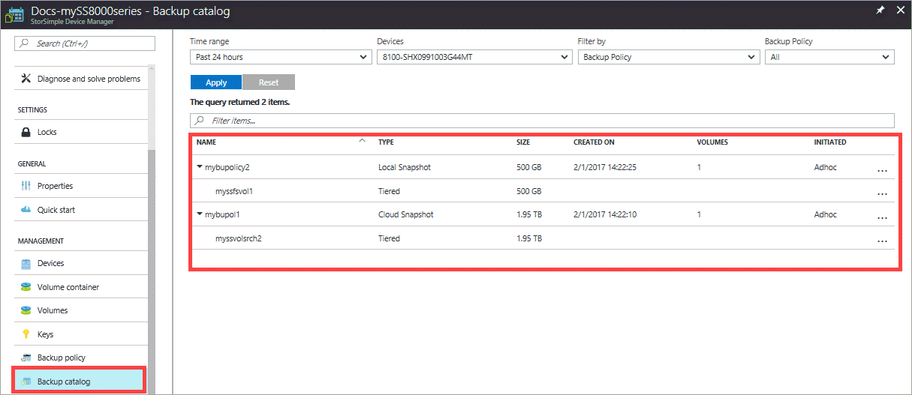
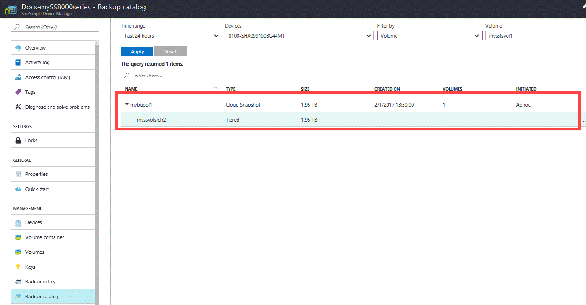
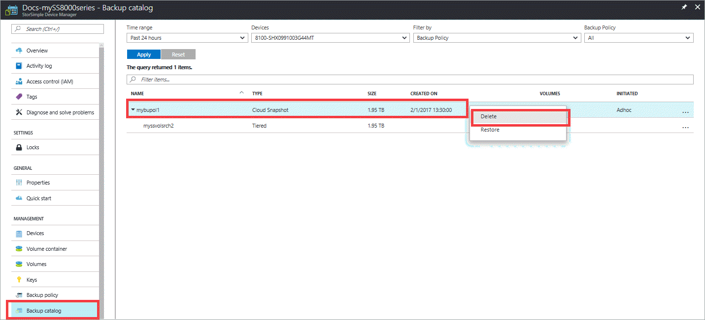
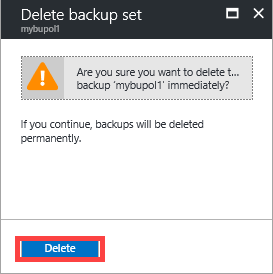
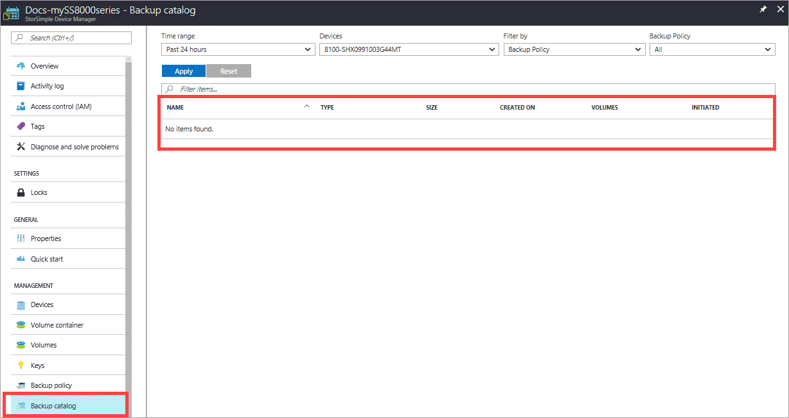

# Use the StorSimple Device Manager service to manage your backup catalog
## Overview
The StorSimple Device Manager service **Backup Catalog** blade displays all the backup sets that are created when manual or scheduled backups are taken. You can use this page to list all the backups for a backup policy or a volume, select or delete backups, or use a backup to restore or clone a volume.

This tutorial explains how to list, select, and delete a backup set. To learn how to restore your device from backup, go to [Restore your device from a backup set](storsimple-8000-restore-from-backup-set-u2.md). To learn how to clone a volume, go to [Clone a StorSimple volume](storsimple-8000-clone-volume-u2.md).

 

The **Backup Catalog** blade provides a query to narrow your backup set selection. You can filter the backup sets that are retrieved, based on the following parameters:

* **Device** – The device on which the backup set was created.
* **Backup policy or Volume** – The backup policy or volume associated with this backup set.
* **From and To** – The date and time range when the backup set was created.

The filtered backup sets are then tabulated based on the following attributes:

* **Name** – The name of the backup policy or volume associated with the backup set.
* **Size** – The actual size of the backup set.
* **Created On** – The date and time when the backups were created. 
* **Type** – Backup sets can be local snapshots or cloud snapshots. A local snapshot is a backup of all your volume data stored locally on the device, whereas a cloud snapshot refers to the backup of volume data residing in the cloud. Local snapshots provide faster access, whereas cloud snapshots are chosen for data resiliency.
* **Initiated By** – The backups can be initiated automatically by a schedule or manually by a user. You can use a backup policy to schedule backups. Alternatively, you can use the **Take backup** option to take a manual backup.

## List backup sets for a backup policy
Complete the following steps to list all the backups for a backup policy.

#### To list backup sets
1. Go to your StorSimple Device Manager service and click **Backup catalog**.

2. Filter the selections as follows:
   
   1. Specify the time range.
   2. Select the appropriate device.
   3. Filter by **Backup policy** to view the corresponding the backups.
   3. From the backup policy dropdown list, choose **All** to view all the backups on the selected device.
   4. Click **Apply** to execute this query.
      
      The backups associated with the selected backup policy should appear in the list of backup sets.

      

## Select a backup set
Complete the following steps to select a backup set for a volume or backup policy.

#### To select a backup set
1. Go to your StorSimple Device Manager service and click **Backup catalog**.
2. Filter the selections as follows:
   
   1. Specify the time range. 
   2. Select the appropriate device. 
   3. Filter by volume or backup policy for the backup that you wish to select.
   4. Click **Apply** to execute this query.
      
      The backups associated with the selected volume or backup policy should appear in the list of backup sets.

      

3. Select and expand a backup set. You can now see the backup sets broken down by the volumes that it contains. The **Restore** and **Delete** options are available via the context menu (right-click) for the backup set. You can perform either of these actions on the backup set that you selected.

    

## Delete a backup set
Delete a backup when you no longer wish to retain the data associated with it. Perform the following steps to delete a backup set.

#### To delete a backup set
 Go to your StorSimple Device Manager service and click **Backup catalog**.
2. Filter the selections as follows:
   
   1. Specify the time range. 
   2. Select the appropriate device. 
   3. Filter by volume or backup policy for the backup that you wish to select.
   4. Click **Apply** to execute this query.
      
      The backups associated with the selected volume or backup policy should appear in the list of backup sets.

      

3. Select and expand a backup set. You can now see the backup sets broken down by the volumes that it contains. The **Restore** and **Delete** options are available via the context menu (right-click) for the backup set. Right-click the selected backup set and from the context menu, select **Delete**.

    

4. When prompted for confirmation, review the displayed information and click **Delete**. The selected backup is deleted permanently.

      

5. You will be notified when the deletion is in progress and when it has successfully finished. After the deletion is done, refresh the query on this page. The deleted backup set will no longer appear in the list of backup sets.

    

## Next steps
* Learn how to [use the backup catalog to restore your device from a backup set](storsimple-8000-restore-from-backup-set-u2.md).
* Learn how to [use the StorSimple Device Manager service to administer your StorSimple device](storsimple-8000-manager-service-administration.md).

