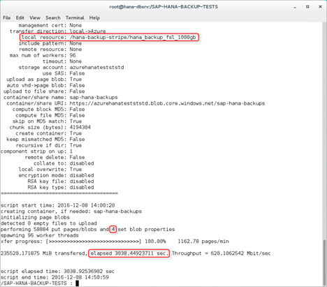
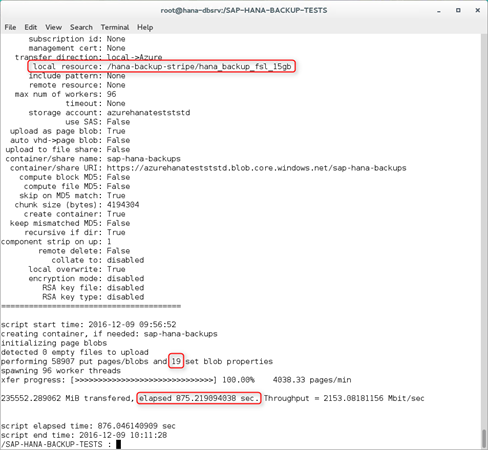
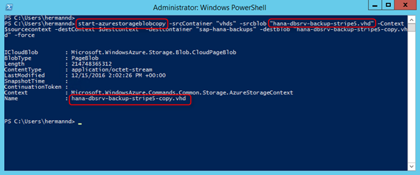
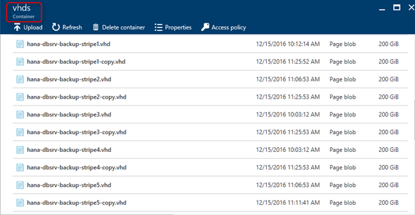
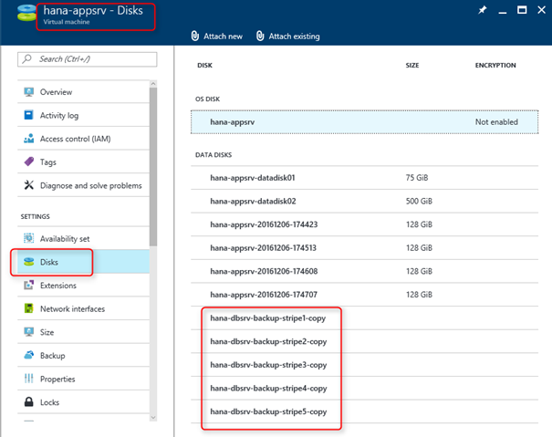
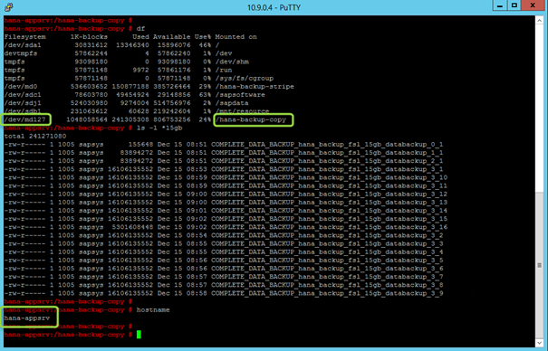
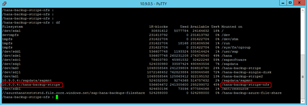
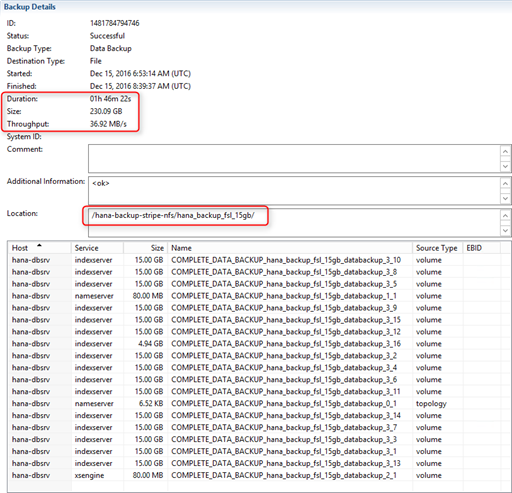
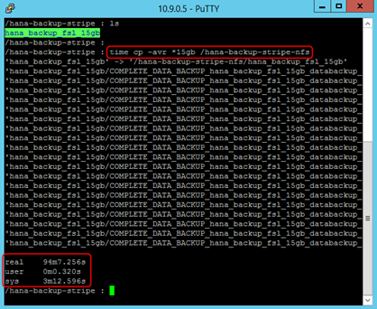
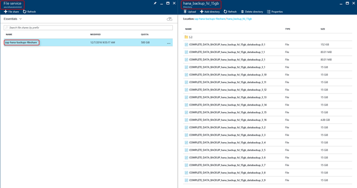

# SAP HANA Azure Backup on file level

## Introduction

This is part of a three-part series of related articles on SAP HANA backup. [Backup guide for SAP HANA on Azure Virtual Machines](./sap-hana-backup-guide.md) provides an overview and information on getting started, and [SAP HANA backup based on storage snapshots](./sap-hana-backup-storage-snapshots.md) covers the storage snapshot-based backup option.

Looking at the Azure VM sizes, one can see that a GS5 allows 64 attached data disks. For large SAP HANA systems, a significant number of disks might already be taken for data and log files, possibly in combination with software RAID for optimal disk IO throughput. The question then is where to store SAP HANA backup files, which could fill up the attached data disks over time? See [Sizes for Linux virtual machines in Azure](../../linux/sizes.md) for the Azure VM size tables.

There is no SAP HANA backup integration available with Azure Backup service at this time. The standard way to manage backup/restore at the file level is with a file-based backup via SAP HANA Studio or via SAP HANA SQL statements. See [SAP HANA SQL and System Views Reference](https://help.sap.com/hana/SAP_HANA_SQL_and_System_Views_Reference_en.pdf) for more information.

This figure shows the dialog of the backup menu item in SAP HANA Studio. When choosing type &quot;file,&quot; one has to specify a path in the file system where SAP HANA writes the backup files. Restore works the same way.

While this choice sounds simple and straight forward, there are some considerations. As mentioned before, an Azure VM has a limitation of number of data disks that can be attached. There might not be capacity to store SAP HANA backup files on the file systems of the VM, depending on the size of the database and disk throughput requirements, which might involve software RAID using striping across multiple data disks. Various options for moving these backup files, and managing file size restrictions and performance when handling terabytes of data, are provided later in this article.

Another option, which offers more freedom regarding total capacity, is Azure blob storage. While a single blob is also restricted to 1 TB, the total capacity of a single blob container is currently 500 TB. Additionally, it gives customers the choice to select so-called &quot;cool&quot; blob storage, which has a cost benefit. See [Azure Blob Storage: Hot and cool storage tiers](../../../storage/blobs/storage-blob-storage-tiers.md) for details about cool blob storage.

For additional safety, use a geo-replicated storage account to store the SAP HANA backups. See [Azure Storage replication](../../../storage/common/storage-redundancy.md) for details about storage account replication.

One could place dedicated VHDs for SAP HANA backups in a dedicated backup storage account that is geo-replicated. Or else one could copy the VHDs that keep the SAP HANA backups to a geo-replicated storage account, or to a storage account that is in a different region.

## Azure backup agent

Azure backup offers the option to not only back up complete VMs, but also files and directories via the backup agent, which has to be installed on the guest OS. But as of December 2016, this agent is only supported on Windows (see [Back up a Windows Server or client to Azure using the Resource Manager deployment model](../../../backup/backup-configure-vault.md)).

A workaround is to first copy SAP HANA backup files to a Windows VM on Azure (for example, via SAMBA share) and then use the Azure backup agent from there. While it is technically possible, it would add complexity and slow down the backup or restore process quite a bit due to the copy between the Linux and the Windows VM. It is not recommended to follow this approach.

## Azure blobxfer utility details

To store directories and files on Azure storage, one could use CLI or PowerShell, or develop a tool using one of the [Azure SDKs](https://azure.microsoft.com/downloads/). There is also a ready-to-use utility, AzCopy, for copying data to Azure storage, but it is Windows only (see [Transfer data with the AzCopy Command-Line Utility](../../../storage/common/storage-use-azcopy.md)).

Therefore blobxfer was used for copying SAP HANA backup files. It is open source, used by many customers in production environments, and available on [GitHub](https://github.com/Azure/blobxfer). This tool allows one to copy data directly to either Azure blob storage or Azure file share. It also offers a range of useful features, like md5 hash or automatic parallelism when copying a directory with multiple files.

## SAP HANA backup performance

This screenshot is of the SAP HANA backup console in SAP HANA Studio. It took about 42 minutes to do the backup of the 230 GB on a single Azure standard storage disk attached to the HANA VM using XFS file system.

This screenshot is of YaST on the SAP HANA test VM. One can see the 1-TB single disk for SAP HANA backup as mentioned before. It took about 42 minutes to backup 230 GB. In addition, five 200-GB disks were attached and software RAID md0 created, with striping on top of these five Azure data disks.

Repeating the same backup on software RAID with striping across five attached Azure standard storage data disks brought the backup time from 42 minutes down to 10 minutes. The disks were attached without caching to the VM. So it is obvious how important disk write throughput is for the backup time. One could then switch to Azure premium storage to further accelerate the process for optimal performance. In general, Azure premium storage should be used for production systems.

## Copy SAP HANA backup files to Azure blob storage

As of December 2016, the best option to quickly store SAP HANA backup files is Azure blob storage. One single blob container has a limit of 500 TB, enough for most SAP HANA systems, running in a GS5 VM on Azure, to keep sufficient SAP HANA backups. Customers have the choice between &quot;hot&quot; and &quot;cold&quot; blob storage (see [Azure Blob Storage: Hot and cool storage tiers](../../../storage/blobs/storage-blob-storage-tiers.md)).

With the blobxfer tool, it is easy to copy the SAP HANA backup files directly to Azure blob storage.

Here one can see the files of a full SAP HANA file backup. There are four files and the biggest one has roughly 230 GB.

Not using md5 hash in the initial test, it took roughly 3000 seconds to copy the 230 GB to an Azure standard storage account blob container.

In this screenshot, one can see how it looks on the Azure portal. A blob container named &quot;sap-hana-backups&quot; was created and includes the four blobs, which represent the SAP HANA backup files. One of them has a size of roughly 230 GB.

The HANA Studio backup console allows one to restrict the max file size of HANA backup files. In the sample environment, it improved performance by making it possible to have multiple smaller backup files, instead of one large 230-GB file.

Setting the backup file size limit on the HANA side doesn&#39;t improve the backup time, because the files are written sequentially as shown in this figure. The file size limit was set to 60 GB, so the backup created four large data files instead of the 230-GB single file.

To test parallelism of the blobxfer tool, the max file size for HANA backups was then set to 15 GB, which resulted in 19 backup files. This configuration brought the time for blobxfer to copy the 230 GB to Azure blob storage from 3000 seconds down to 875 seconds.

This result is due to the limit of 60 MB/sec for writing an Azure blob. Parallelism via multiple blobs solves the bottleneck, but there is a downside: increasing performance of the blobxfer tool to copy all these HANA backup files to Azure blob storage puts load on both the HANA VM and the network. Operation of HANA system becomes impacted.

## Blob copy of dedicated Azure data disks in backup software RAID

Unlike the manual VM data disk backup, in this approach one does not back up all the data disks on a VM to save the whole SAP installation, including HANA data, HANA log files, and config files. Instead, the idea is to have dedicated software RAID with striping across multiple Azure data VHDs for storing a full SAP HANA file backup. One copies only these disks, which have the SAP HANA backup. They could easily be kept in a dedicated HANA backup storage account, or attached to a dedicated &quot;backup management VM&quot; for further processing.

After the backup to the local software RAID was completed, all VHDs involved were copied using the **start-azurestorageblobcopy** PowerShell command (see [Start-AzureStorageBlobCopy](/powershell/module/azure.storage/start-azurestorageblobcopy)). As it only affects the dedicated file system for keeping the backup files, there are no concerns about SAP HANA data or log file consistency on the disk. A benefit of this command is that it works while the VM stays online. To be certain that no process writes to the backup stripe set, be sure to unmount it before the blob copy, and mount it again afterwards. Or one could use an appropriate way to &quot;freeze&quot; the file system. For example, via xfs\_freeze for the XFS file system.

This screenshot shows the list of blobs in the &quot;vhds&quot; container on the Azure portal. The screenshot shows the five VHDs, which were attached to the SAP HANA server VM to serve as the software RAID to keep SAP HANA backup files. It also shows the five copies, which were taken via the blob copy command.

For testing purposes, the copies of the SAP HANA backup software RAID disks were attached to the app server VM.

The app server VM was shut down to attach the disk copies. After starting the VM, the disks and the RAID were discovered correctly (mounted via UUID). Only the mount point was missing, which was created via the YaST partitioner. Afterwards the SAP HANA backup file copies became visible on OS level.

## Copy SAP HANA backup files to NFS share

To lessen the potential impact on the SAP HANA system from a performance or disk space perspective, one might consider storing the SAP HANA backup files on an NFS share. Technically it works, but it means using a second Azure VM as the host of the NFS share. It should not be a small VM size, due to the VM network bandwidth. It would make sense then to shut down this &quot;backup VM&quot; and only bring it up for executing the SAP HANA backup. Writing on an NFS share puts load on the network and impacts the SAP HANA system, but merely managing the backup files afterwards on the &quot;backup VM&quot; would not influence the SAP HANA system at all.

To verify the NFS use case, an NFS share from another Azure VM was mounted to the SAP HANA server VM. There was no special NFS tuning applied.

The NFS share was a fast stripe set, like the one on the SAP HANA server. Nevertheless, it took 1 hour and 46 minutes to do the backup directly on the NFS share instead of 10 minutes, when writing to a local stripe set.

The alternative of doing a backup to a local stripe set and copying to the NFS share on OS level (a simple **cp -avr** command) wasn't much quicker. It took 1 hour and 43 minutes.

So it works, but performance wasn't good for the 230-GB backup test. It would look even worse for multi terabytes.

## Copy SAP HANA backup files to Azure file service

It is possible to mount an Azure file share inside an Azure Linux VM. The article [How to use Azure File storage with Linux](../../../storage/files/storage-how-to-use-files-linux.md) provides details on how to do it. Keep in mind that there is currently a 5-TB quota limit of one Azure file share, and a file size limit of 1 TB per file. See [Azure Storage Scalability and Performance Targets](../../../storage/common/storage-scalability-targets.md) for information on storage limits.

Tests have shown, however, that SAP HANA backup doesn&#39;t currently work directly with this kind of CIFS mount. It is also stated in [SAP Note 1820529](https://launchpad.support.sap.com/#/notes/1820529) that CIFS is not recommended.

This figure shows an error in the backup dialog in SAP HANA Studio, when trying to back up directly to a CIFS-mounted Azure file share. So one has to do a standard SAP HANA backup into a VM file system first, and then copy the backup files from there to Azure file service.

This figure shows that it took about 929 seconds to copy 19 SAP HANA backup files with a total size of roughly 230 GB to the Azure file share.

In this screenshot, one can see that the source directory structure on the SAP HANA VM was copied to the Azure file share: one directory (hana\_backup\_fsl\_15gb) and 19 individual backup files.

Storing SAP HANA backup files on Azure files could be an interesting option in the future when SAP HANA file backups support it directly. Or when it becomes possible to mount Azure files via NFS and the maximum quota limit is considerably higher than 5 TB.

## Next steps
* [Backup guide for SAP HANA on Azure Virtual Machines](sap-hana-backup-guide.md) gives an overview and information on getting started.
* [SAP HANA backup based on storage snapshots](sap-hana-backup-storage-snapshots.md) describes the storage snapshot-based backup option.
* To learn how to establish high availability and plan for disaster recovery of SAP HANA on Azure (large instances), see [SAP HANA (large instances) high availability and disaster recovery on Azure](hana-overview-high-availability-disaster-recovery.md).
