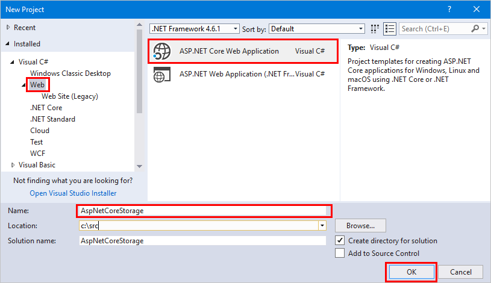
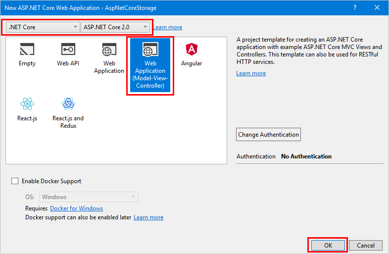
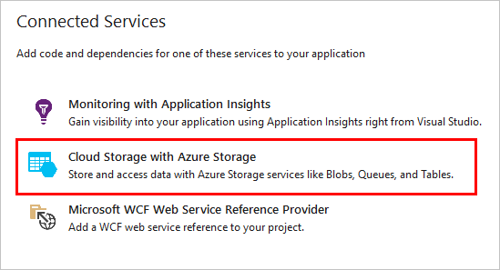
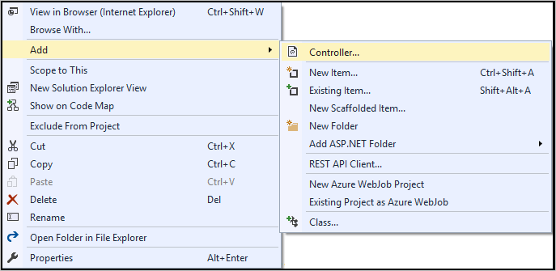
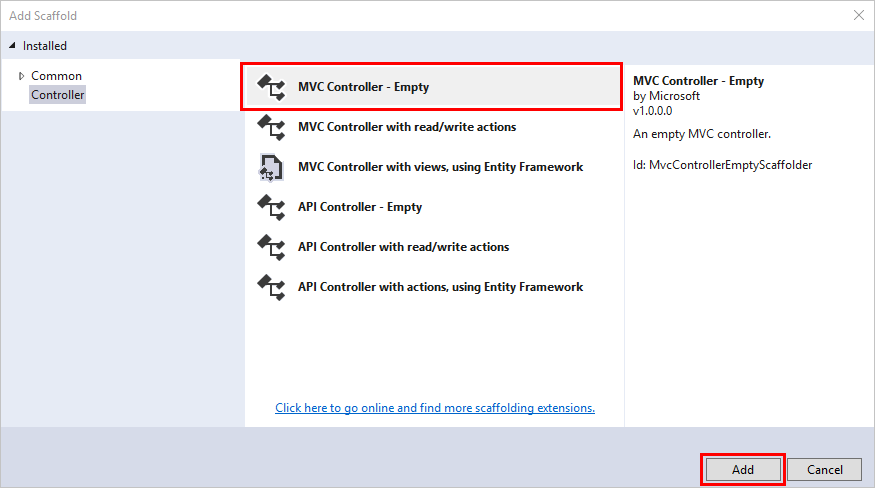
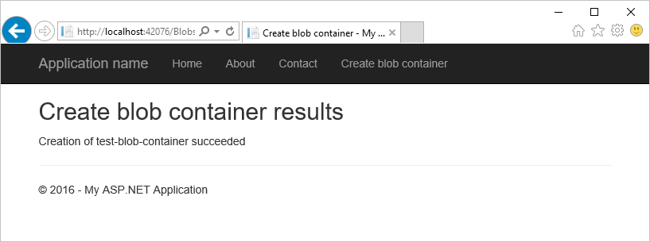
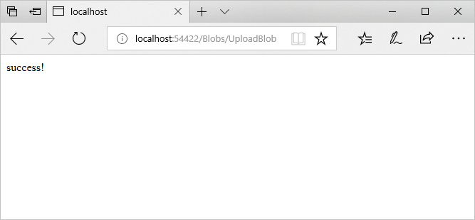

# Get started with Azure Blob storage and Visual Studio connected services (ASP.NET Core)

> [!div class="op_single_selector"]
> - [ASP.NET](./vs-storage-aspnet-getting-started-blobs.md)
> - [ASP.NET Core](./vs-storage-aspnet-core-getting-started-blobs.md)

Azure Blob storage is a service that stores unstructured data in the cloud as objects or blobs. Blob storage can store any type of text or binary data, such as a document, media file, or application installer. Blob storage is also referred to as object storage.

This tutorial shows how to write ASP.NET Core code for some common scenarios that use Blob storage. Scenarios 
include creating a blob container, and uploading, listing, downloading, and deleting blobs.

[!INCLUDE [storage-try-azure-tools-blobs](../../includes/storage-try-azure-tools-blobs.md)]

## Prerequisites

* [Microsoft Visual Studio](https://www.visualstudio.com/downloads/)

[!INCLUDE [storage-blob-concepts-include](../../includes/storage-blob-concepts-include.md)]

## Set up the development environment

This section walks through setting up the development environment. This includes creating an ASP.NET Model-View-Controller (MVC) app, adding a connected services connection, adding a controller, and specifying the required namespace directives.

### Create an ASP.NET MVC app project

1. Open Visual Studio.

1. From the main menu, select **File** > **New** > **Project**.

1. In the **New Project** dialog box, select **Web** > **ASP.NET Core Web Application** > **AspNetCoreStorage**. Then select **OK**.

	

1. In the **New ASP.NET Core Web Application** dialog box, select **.NET Core** > **ASP.NET Core 2.0** > **Web Application (Model-View-Controller)**. Then select **OK**.

	

### Use connected services to connect to an Azure storage account

1. In **Solution Explorer**, right-click the project.

2. From the context menu, select **Add** > **Connected Service**.

1. In the **Connected Services** dialog box, select **Cloud Storage with Azure Storage**, and then select **Configure**.

	

1. In the **Azure Storage** dialog box, select the Azure storage account to be used for this tutorial. To create a new Azure storage account, select **Create a New Storage Account**, and complete the form. After selecting either an existing storage account or creating a new one, select **Add**. Visual Studio installs the NuGet package for Azure Storage, and a storage connection string to **appsettings.json**.

> [!TIP]
> To learn how to create a storage account with the [Azure portal](https://portal.azure.com), see [Create a storage account](../storage/common/storage-create-storage-account.md#create-a-storage-account).
>
> You can also create a storage account by using [Azure PowerShell](../storage/common/storage-powershell-guide-full.md), [Azure CLI](../storage/common/storage-azure-cli.md), or [Azure Cloud Shell](../cloud-shell/overview.md).


### Create an MVC controller 

1. In **Solution Explorer**, right-click **Controllers**.

2. From the context menu, select **Add** > **Controller**.

	

1. In the **Add Scaffold** dialog box, select **MVC Controller - Empty**, and select **Add**.

	

1. In the **Add Empty MVC Controller** dialog box, name the controller *BlobsController*, and select **Add**.

	

1. Add the following `using` directives to the `BlobsController.cs` file:

    ```csharp
    using System.IO;
    using Microsoft.Extensions.Configuration;
    using Microsoft.WindowsAzure.Storage;
    using Microsoft.WindowsAzure.Storage.Blob;
	```

## Connect to a storage account and get a container reference

A blob container is a nested hierarchy of blobs and folders. The rest of the steps in this document require a reference to a blob container, so that code should be placed in its own method for reusability.

The following steps create a method to connect to the storage account by using the connection string in **appsettings.json**. The steps also create a reference to a container. The connection string setting in **appsettings.json** is named with the format `<storageaccountname>_AzureStorageConnectionString`. 

1. Open the `BlobsController.cs` file.

1. Add a method called **GetCloudBlobContainer** that returns a **CloudBlobContainer**. Be sure to replace `<storageaccountname>_AzureStorageConnectionString` with the actual name of the key in **Web.config**.
    
    ```csharp
    private CloudBlobContainer GetCloudBlobContainer()
    {
        var builder = new ConfigurationBuilder()
            .SetBasePath(Directory.GetCurrentDirectory())
            .AddJsonFile("appsettings.json");
        IConfigurationRoot Configuration = builder.Build();
        CloudStorageAccount storageAccount = 
            CloudStorageAccount.Parse(Configuration["ConnectionStrings:aspnettutorial_AzureStorageConnectionString"]);
        CloudBlobClient blobClient = storageAccount.CreateCloudBlobClient();
        CloudBlobContainer container = blobClient.GetContainerReference("test-blob-container");
        return container;
    }
    ```

> [!NOTE]
> Even though *test-blob-container* doesn't exist yet, this code creates a reference to it. This is so the container can be created with the `CreateIfNotExists` method shown in the next step.

## Create a blob container

The following steps illustrate how to create a blob container:

1. Add a method called `CreateBlobContainer` that returns an `ActionResult`.

    ```csharp
    public ActionResult CreateBlobContainer()
    {
		// The code in this section goes here.

        return View();
    }
    ```
 
1. Get a `CloudBlobContainer` object that represents a reference to the desired blob container name. 
   
    ```csharp
    CloudBlobContainer container = GetCloudBlobContainer();
    ```

1. Call the `CloudBlobContainer.CreateIfNotExists` method to create the container, if it does not yet exist. The `CloudBlobContainer.CreateIfNotExists` method returns **true** if the container does not exist, and is successfully created. Otherwise, the method returns **false**.    

    ```csharp
    ViewBag.Success = container.CreateIfNotExistsAsync().Result;
    ```

1. Update `ViewBag` with the name of the blob container.

    ```csharp
	ViewBag.BlobContainerName = container.Name;
    ```
    
    The following shows the completed `CreateBlobContainer` method:

    ```csharp
    public ActionResult CreateBlobContainer()
    {
        CloudBlobContainer container = GetCloudBlobContainer();
        ViewBag.Success = container.CreateIfNotExistsAsync().Result;
        ViewBag.BlobContainerName = container.Name;

        return View();
    }
    ```

1. In **Solution Explorer**, right-click the **Views** folder.

2. From the context menu, select **Add** > **New Folder**. Name the new folder *Blobs*. 

1. In **Solution Explorer**, expand the **Views** folder, and right-click **Blobs**.

4. From the context menu, select **Add** > **View**.

1. In the **Add View** dialog box, enter **CreateBlobContainer** for the view name, and select **Add**.

1. Open `CreateBlobContainer.cshtml`, and modify it so that it looks like the following code snippet:

    ```csharp
    @{
        ViewBag.Title = "Create Blob Container";
    }
    
    <h2>Create Blob Container results</h2>
    
    Creation of @ViewBag.BlobContainerName @(ViewBag.Success == true ? "succeeded" : "failed")
    ```

1. In **Solution Explorer**, expand the **Views** > **Shared** folder, and open `_Layout.cshtml`.

1. Look for the unordered list that looks like this: `<ul class="nav navbar-nav">`.  After the last `<li>` element in the list, add the following HTML to add another navigation menu item:

    ```html
	<li><a asp-area="" asp-controller="Blobs" asp-action="CreateBlobContainer">Create blob container</a></li>
    ```

1. Run the application, and select **Create Blob Container** to see results similar to the following screenshot:
  
	

	As mentioned previously, the `CloudBlobContainer.CreateIfNotExists` method returns **true** only when the container doesn't exist and is created. Therefore, if the app is run when the container exists, the method returns **false**.

## Upload a blob into a blob container

When the [blob container is created](#create-a-blob-container), upload files into that container. This section walks through uploading a local file to a blob container. The steps assume there is a blob container named *test-blob-container*. 

1. Open the `BlobsController.cs` file.

1. Add a method called `UploadBlob` that returns a string.

    ```csharp
    public string UploadBlob()
    {
		// The code in this section goes here.

        return "success!";
    }
    ```
 
1. Within the `UploadBlob` method, get a `CloudBlobContainer` object that represents a reference to the desired blob container name. 
   
    ```csharp
    CloudBlobContainer container = GetCloudBlobContainer();
    ```

1. Azure storage supports different blob types. This tutorial uses block blobs. To retrieve a reference to a block blob, call the `CloudBlobContainer.GetBlockBlobReference` method.

    ```csharp
    CloudBlockBlob blob = container.GetBlockBlobReference("myBlob");
    ```
    
    > [!NOTE]
    > The blob name is part of the URL used to retrieve a blob, and can be any string, including the name of the file.

1. After there is a blob reference, you can upload any data stream to it by calling the blob reference object's `UploadFromStream` method. The `UploadFromStream` method creates the blob if it doesn't exist, or overwrites it if it does exist. (Change *&lt;file-to-upload>* to a fully qualified path to a file to be uploaded.)

    ```csharp
    using (var fileStream = System.IO.File.OpenRead(@"<file-to-upload>"))
    {
        blob.UploadFromStreamAsync(fileStream).Wait();
    }
    ```
    
    The following shows the completed `UploadBlob` method (with a fully qualified path for the file to be uploaded):

    ```csharp
    public string UploadBlob()
    {
        CloudBlobContainer container = GetCloudBlobContainer();
        CloudBlockBlob blob = container.GetBlockBlobReference("myBlob");
        using (var fileStream = System.IO.File.OpenRead(@"c:\src\sample.txt"))
        {
            blob.UploadFromStreamAsync(fileStream).Wait();
        }
        return "success!";
    }
    ```

1. In **Solution Explorer**, expand the **Views** > **Shared** folder, and open `_Layout.cshtml`.

1. After the last `<li>` element in the list, add the following HTML to add another navigation menu item:

    ```html
	<li><a asp-area="" asp-controller="Blobs" asp-action="UploadBlob">Upload blob</a></li>
    ```

1. Run the application, and select **Upload blob**. The word *success!* should appear.
    
    
  
## List the blobs in a blob container

This section illustrates how to list the blobs in a blob container. The sample code references the *test-blob-container* created in the section, [Create a blob container](#create-a-blob-container).

1. Open the `BlobsController.cs` file.

1. Add a method called `ListBlobs` that returns an `ActionResult`.

    ```csharp
    public ActionResult ListBlobs()
    {
		// The code in this section goes here.

    }
    ```
 
1. Within the `ListBlobs` method, get a `CloudBlobContainer` object that represents a reference to the blob container. 
   
    ```csharp
    CloudBlobContainer container = GetCloudBlobContainer();
    ```
   
1. To list the blobs in a blob container, use the `CloudBlobContainer.ListBlobsSegmentedAsync` method. The `CloudBlobContainer.ListBlobsSegmentedAsync` method returns a `BlobResultSegment`. This contains `IListBlobItem` objects that can be cast to `CloudBlockBlob`, `CloudPageBlob`, or `CloudBlobDirectory` objects. The following code snippet enumerates all the blobs in a blob container. Each blob is cast to the appropriate object, based on its type. Its name (or URI in the case of a `CloudBlobDirectory`) is added to a list.

    ```csharp
    List<string> blobs = new List<string>();
    BlobResultSegment resultSegment = container.ListBlobsSegmentedAsync(null).Result;
    foreach (IListBlobItem item in resultSegment.Results)
    {
        if (item.GetType() == typeof(CloudBlockBlob))
        {
            CloudBlockBlob blob = (CloudBlockBlob)item;
            blobs.Add(blob.Name);
        }
        else if (item.GetType() == typeof(CloudPageBlob))
        {
            CloudPageBlob blob = (CloudPageBlob)item;
            blobs.Add(blob.Name);
        }
        else if (item.GetType() == typeof(CloudBlobDirectory))
        {
            CloudBlobDirectory dir = (CloudBlobDirectory)item;
            blobs.Add(dir.Uri.ToString());
        }
    }

	return View(blobs);
    ```
    The following shows the completed `ListBlobs` method:

    ```csharp
    public ActionResult ListBlobs()
    {
        CloudBlobContainer container = GetCloudBlobContainer();
        List<string> blobs = new List<string>();
        BlobResultSegment resultSegment = container.ListBlobsSegmentedAsync(null).Result;
        foreach (IListBlobItem item in resultSegment.Results)
        {
            if (item.GetType() == typeof(CloudBlockBlob))
            {
                CloudBlockBlob blob = (CloudBlockBlob)item;
                blobs.Add(blob.Name);
            }
            else if (item.GetType() == typeof(CloudPageBlob))
            {
                CloudPageBlob blob = (CloudPageBlob)item;
                blobs.Add(blob.Name);
            }
            else if (item.GetType() == typeof(CloudBlobDirectory))
            {
                CloudBlobDirectory dir = (CloudBlobDirectory)item;
                blobs.Add(dir.Uri.ToString());
            }
        }

        return View(blobs);
    }
    ```

1. In **Solution Explorer**, expand the **Views** folder, and right-click **Blobs**.

2. From the context menu, select **Add** > **View**.

1. In the **Add View** dialog box, enter `ListBlobs` for the view name, and select **Add**.

1. Open `ListBlobs.cshtml`, and replace the contents with the following code:

    ```html
    @model List<string>
    @{
        ViewBag.Title = "List blobs";
    }
    
    <h2>List blobs</h2>
    
    <ul>
        @foreach (var item in Model)
        {
            <li>@item</li>
        }
    </ul>
    ```

1. In **Solution Explorer**, expand the **Views** > **Shared** folder, and open `_Layout.cshtml`.

1. After the last `<li>` element in the list, add the following HTML to add another navigation menu item:

    ```html
	<li><a asp-area="" asp-controller="Blobs" asp-action="ListBlobs">List blobs</a></li>
    ```

1. Run the application, and select **List blobs** to see results similar to the following screenshot:
  
	

## Download blobs

This section illustrates how to download a blob. You can either persist it to local storage or read the contents into a string. The sample code references the *test-blob-container* created in the section, [Create a blob container](#create-a-blob-container).

1. Open the `BlobsController.cs` file.

1. Add a method called `DownloadBlob` that returns a string.

    ```csharp
    public string DownloadBlob()
    {
		// The code in this section goes here.

        return "success!";
    }
    ```
 
1. Within the `DownloadBlob` method, get a `CloudBlobContainer` object that represents a reference to the blob container.
   
    ```csharp
    CloudBlobContainer container = GetCloudBlobContainer();
    ```

1. Get a blob reference object by calling the `CloudBlobContainer.GetBlockBlobReference` method. 

    ```csharp
    CloudBlockBlob blob = container.GetBlockBlobReference("myBlob");
    ```

1. To download a blob, use the `CloudBlockBlob.DownloadToStream` method. The following code transfers a blob's contents to a stream object. That object is then persisted to a local file. (Change *&lt;local-file-name>* to the fully qualified file name representing where the blob is to be downloaded.) 

    ```csharp
    using (var fileStream = System.IO.File.OpenWrite(<local-file-name>))
    {
        blob.DownloadToStreamAsync(fileStream).Wait();
    }
    ```
    
    The following shows the completed `ListBlobs` method (with a fully qualified path for the local file being created):
    
    ```csharp
    public string DownloadBlob()
    {
        CloudBlobContainer container = GetCloudBlobContainer();
        CloudBlockBlob blob = container.GetBlockBlobReference("myBlob");
        using (var fileStream = System.IO.File.OpenWrite(@"c:\src\downloadedBlob.txt"))
        {
            blob.DownloadToStreamAsync(fileStream).Wait();
        }
        return "success!";
    }
    ```

1. In **Solution Explorer**, expand the **Views** > **Shared** folder, and open `_Layout.cshtml`.

1. After the last `<li>` element in the list, add the following HTML to add another navigation menu item:

    ```html
	<li><a asp-area="" asp-controller="Blobs" asp-action="DownloadBlob">Download blob</a></li>
    ```

1. Run the application, and select **Download blob** to download the blob. The blob specified in the `CloudBlobContainer.GetBlockBlobReference` method call downloads to the location specified in the `File.OpenWrite` method call. The text *success!* should appear in the browser. 

## Delete blobs

The following steps illustrate how to delete a blob:

1. Open the `BlobsController.cs` file.

1. Add a method called `DeleteBlob` that returns a string.

    ```csharp
    public string DeleteBlob()
    {
		// The code in this section goes here.

        return "success!";
    }
    ```

1. Within the `DeleteBlob` method, get a `CloudBlobContainer` object that represents a reference to the blob container.
   
    ```csharp
    CloudBlobContainer container = GetCloudBlobContainer();
    ```

1. Get a blob reference object by calling the `CloudBlobContainer.GetBlockBlobReference` method. 

    ```csharp
    CloudBlockBlob blob = container.GetBlockBlobReference("myBlob");
    ```

1. To delete a blob, use the `Delete` method.

    ```csharp
    blob.DeleteAsync().Wait();
    ```
    
    The completed `DeleteBlob` method should appear as follows:
    
    ```csharp
    public string DeleteBlob()
    {
        CloudBlobContainer container = GetCloudBlobContainer();
        CloudBlockBlob blob = container.GetBlockBlobReference("myBlob");
        blob.DeleteAsync().Wait();
        return "success!";
    }
    ```

1. In **Solution Explorer**, expand the **Views** > **Shared** folder, and open `_Layout.cshtml`.

1. After the last `<li>` element in the list, add the following HTML to add another navigation menu item:

    ```html
    <li><a asp-area="" asp-controller="Blobs" asp-action="DeleteBlob">Delete blob</a></li>
    ```

1. Run the application, and select **Delete blob** to delete the blob specified in the `CloudBlobContainer.GetBlockBlobReference` method call. The text *success!* should appear in the browser. Select the browser's **Back** button, and then select **List blobs** to verify that the blob is no longer in the container.

## Next steps

In this tutorial, you learned how to store, list, and retrieve blobs in Azure Storage by using ASP.NET Core. View more feature guides to learn about additional options for storing data in Azure.

  * [Get started with Azure Table storage and Visual Studio connected services (ASP.NET)](vs-storage-aspnet-getting-started-tables.md)
  * [Get started with Azure Queue storage and Visual Studio connected services (ASP.NET)](vs-storage-aspnet-getting-started-queues.md)
