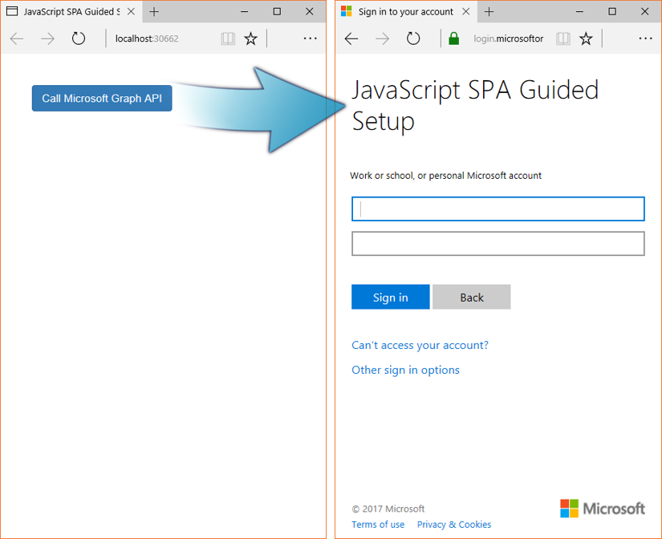
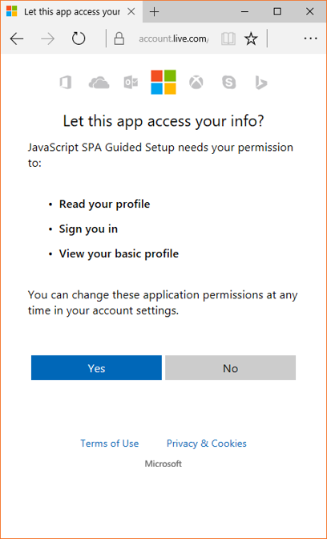
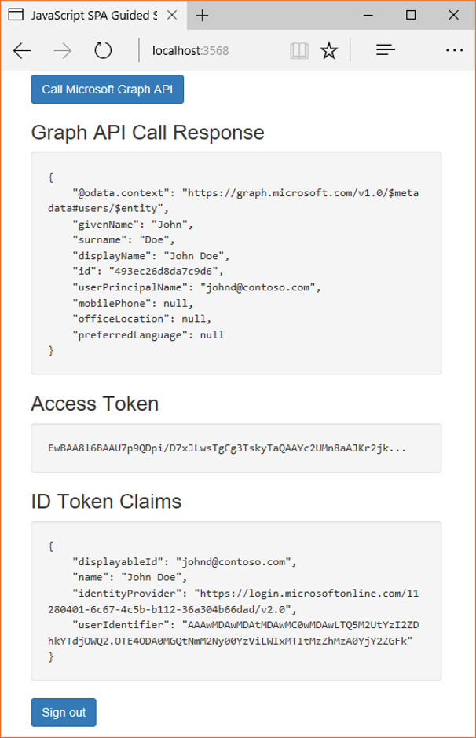

## Test your code

### Test with Visual Studio
If you're using Visual Studio, press **F5** to run your project. The browser opens to the http://<span></span>localhost:{port} location and you see the **Call Microsoft Graph API** button.

<p/><!-- --> 

### Test with Python or other web server
If you're not using Visual Studio, make sure your web server is started. Configure the server to listen to a TCP port that's based on the location of your **index.html** file. For Python, start to listen to the port by running the command prompt terminal from the application folder:
 
```bash
python -m http.server 8080
```
Open the browser and type http://<span></span>localhost:8080 or http://<span></span>localhost:{port} where **port** is the port that your web server is listening to. You should see the contents of your index.html file and the **Call Microsoft Graph API** button.

## Test your application

After the browser loads your index.html file, select **Call Microsoft Graph API**. The first time that you run your application, the browser redirects you to the Microsoft Azure Active Directory (Azure AD) v2.0 endpoint and you're prompted to sign in:
 



### Provide consent for application access

The first time that you sign in to your application, you're prompted to provide your consent to allow the application to access your profile and to sign you in:



### View application results
After you sign in, you should see your user profile information in the **Graph API Call Response** box.
 


You should also see basic information about the token that was acquired in the **Access Token** and **ID Token Claims** boxes.

<!--start-collapse-->
### More information about scopes and delegated permissions

The Microsoft Graph API requires the **user.read** scope to read a user's profile. This scope is automatically added by default in every application that's registered on the registration portal. Other APIs for Microsoft Graph, as well as custom APIs for your back-end server, might require additional scopes. The Microsoft Graph API requires the **Calendars.Read** scope to list the user’s calendars.

To access the user’s calendars in the context of an application, add the **Calendars.Read** delegated permission to the application registration information. Then, add the **Calendars.Read** scope to the **acquireTokenSilent** call. 

>[!NOTE]
>The user might be prompted for additional consents as you increase the number of scopes.

If a back-end API doesn't require a scope (not recommended), you can use the **clientId** as the scope in the **acquireTokenSilent** and **acquireTokenRedirect** calls.

<!--end-collapse-->

[!INCLUDE [Help and support](./active-directory-develop-help-support-include.md)]
